<!-- Made by Jack (iamjustjack.de) -->
# Paper Pop

**Torn paper, pastels, polaroids.** The React component library behind [iamjustjack.de](https://iamjustjack.de) - grown into a full kit for landing pages, dashboards, forums and apps.

- ~100 components, every one with its own doc page, props table, usage snippet and a rendered screenshot (or GIF when it moves)
- used as a **git submodule** - no npm publishing, no build step, full HMR
- an **MCP server** so Claude Code can look up components, props and page recipes while building
- docs, images and this README are **regenerated automatically** on every push (self-hosted runner)

Start a new site from **[PaperPop-Template](https://github.com/JaxLabs-top/PaperPop-Template)** - it already contains the submodule, example pages and the deploy setup.

## Quick start

```bash
git submodule add https://github.com/JaxLabs-top/iamjustjack-PaperPop.git paperpop
```

```ts
// vite.config.ts
import { paperpop } from './paperpop/vite';
export default defineConfig({ plugins: [react(), paperpop()] });
```

```tsx
// main.tsx
import 'paperpop/fonts';
import 'paperpop/styles.css';
import { Button, Paper } from 'paperpop';

<Paper color="lilac" tilt={-1}>
  <h1 className="pp-display">Hallo.</h1>
  <Button>Sag Hallo ♥</Button>
</Paper>
```

Full setup (tsconfig paths, fonts, CI token): [docs/guides/setup.md](docs/guides/setup.md)

## Guides

| | |
| --- | --- |
| [Setup](docs/guides/setup.md) | Submodule, Vite plugin, TypeScript, root imports, CI |
| [Page recipes](docs/guides/recipes.md) | Landing, dashboard, forum, app, links and legal page skeletons |
| [Contributing](docs/guides/contributing.md) | How to add a component, write its story and get docs + GIF generated |
| [Design tokens](src/styles/tokens.css) | Colours, fonts, shadows - override on `:root` |

## MCP server

`mcp/server.mjs` is a dependency-free MCP server (stdio). Add it to a site's `.mcp.json`:

```json
{ "mcpServers": { "paperpop": { "command": "node", "args": ["paperpop/mcp/server.mjs"] } } }
```

Tools: `list_components`, `search_components`, `get_component` (doc + props + source), `get_design_tokens`, `get_setup_guide`, `get_page_recipe`, `get_contributing_guide`. Every component doc is also a resource (`paperpop://components/<Name>`).

## Development

```bash
npm install
npm run dev          # gallery with every component on http://localhost:5190
npm run typecheck
npm run docs         # screenshots/GIFs + docs + README (needs `npx playwright install chromium`)
npm run docs:meta    # docs + README only, keeps existing images
npm run torn         # regenerate the extra torn-edge shapes
```

On every push to `main` the [Docs workflow](.github/workflows/docs.yml) renders everything inside a pinned Playwright container on the self-hosted runner and commits the result as `Update component docs [skip ci]`.

## Components

<!-- COMPONENTS:START -->
<!-- Generated by scripts/docs.ts on every push - do not edit by hand. -->

**102 components** in 10 categories. ✦ = animated (GIF).

### Foundations

<table>
<tr><td width="33%" valign="top"><a href="docs/components/Paper.md"></a><br><b><a href="docs/components/Paper.md">Paper</a></b><br><sub>Torn sheet of paper with a white rim - the core surface for heroes, sections and cards.</sub></td><td width="33%" valign="top"><a href="docs/components/Washi.md">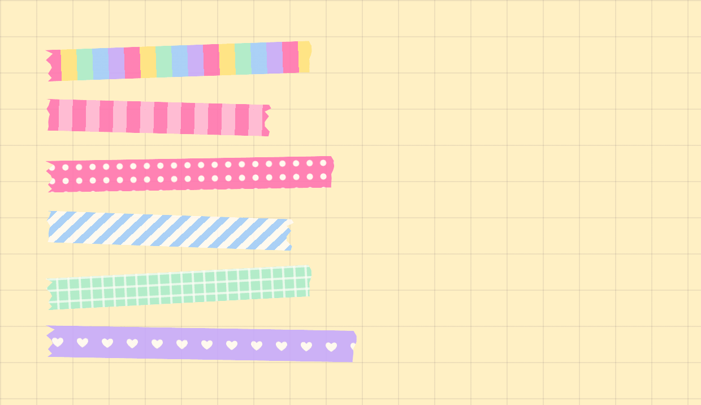</a><br><b><a href="docs/components/Washi.md">Washi</a></b><br><sub>Strips of washi tape in several prints - stick them on polaroids, cards and notes.</sub></td><td width="33%" valign="top"><a href="docs/components/Polaroid.md"></a><br><b><a href="docs/components/Polaroid.md">Polaroid</a></b><br><sub>Polaroid frame with handwritten caption, optional tape and corner tag - for photos or placeholders.</sub></td></tr>
<tr><td width="33%" valign="top"><a href="docs/components/StickyNote.md"></a><br><b><a href="docs/components/StickyNote.md">StickyNote</a></b> ✦<br><sub>Sticky note with a peeling corner (lifts further on hover), pinned with a pushpin or tape.</sub></td><td width="33%" valign="top"><a href="docs/components/TodoList.md">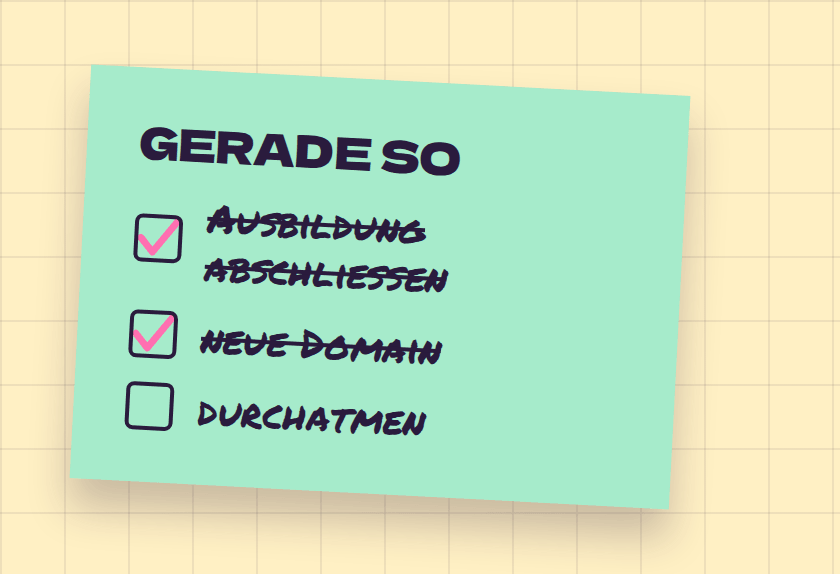</a><br><b><a href="docs/components/TodoList.md">TodoList</a></b><br><sub>Static handwritten to-do list with drawn boxes and pink ticks - best on a StickyNote.</sub></td><td width="33%" valign="top"><a href="docs/components/LabelTags.md">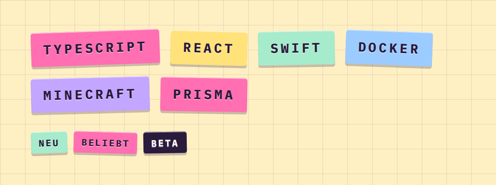</a><br><b><a href="docs/components/LabelTags.md">LabelTags</a></b><br><sub>Label-maker (Dymo) tags for skills, tools and categories.</sub></td></tr>
<tr><td width="33%" valign="top"><a href="docs/components/Stamp.md">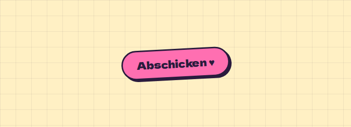</a><br><b><a href="docs/components/Stamp.md">Stamp</a></b> ✦<br><sub>Rubber stamp that thumps onto the page - success states, "sent!", "sold out".</sub></td><td width="33%" valign="top"><a href="docs/components/Sticker.md">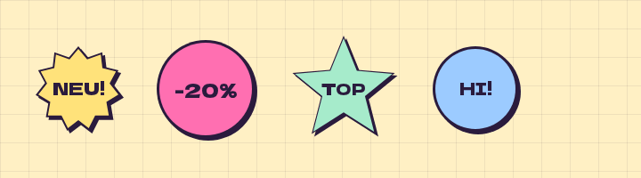</a><br><b><a href="docs/components/Sticker.md">Sticker</a></b> ✦<br><sub>Round, burst or star sticker for "NEU!" labels - wiggles on hover or spins slowly.</sub></td><td width="33%" valign="top"><a href="docs/components/Marker.md">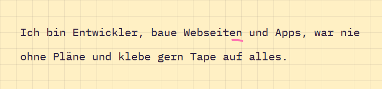</a><br><b><a href="docs/components/Marker.md">Marker</a></b> ✦<br><sub>Marks inline text with a highlighter, scribbled underline, circle, strike or washi tape - drawn in on view.</sub></td></tr>
<tr><td width="33%" valign="top"><a href="docs/components/Doodle.md"></a><br><b><a href="docs/components/Doodle.md">Doodle</a></b> ✦<br><sub>Hand-drawn arrows, circles, squiggles, stars and hearts that draw themselves in.</sub></td><td width="33%" valign="top"><a href="docs/components/Cutline.md">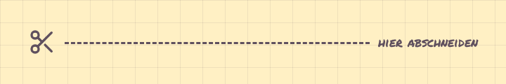</a><br><b><a href="docs/components/Cutline.md">Cutline</a></b> ✦<br><sub>Dashed "cut here" divider - click it and the scissors snip along the line.</sub></td><td width="33%" valign="top"><a href="docs/components/Heading.md">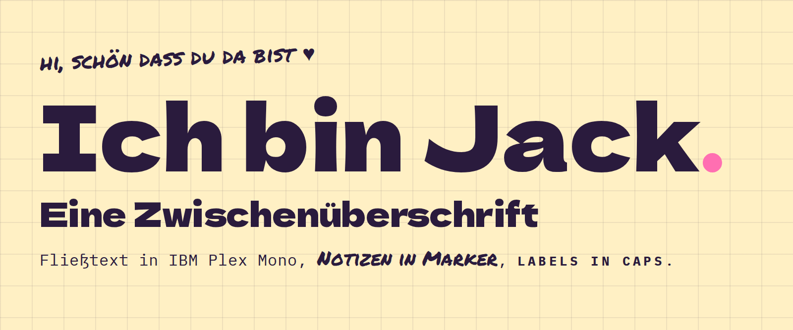</a><br><b><a href="docs/components/Heading.md">Heading</a></b><br><sub>Chunky display headings in five sizes plus the handwritten Kicker line.</sub></td></tr>
<tr><td width="33%" valign="top"><a href="docs/components/Notebook.md">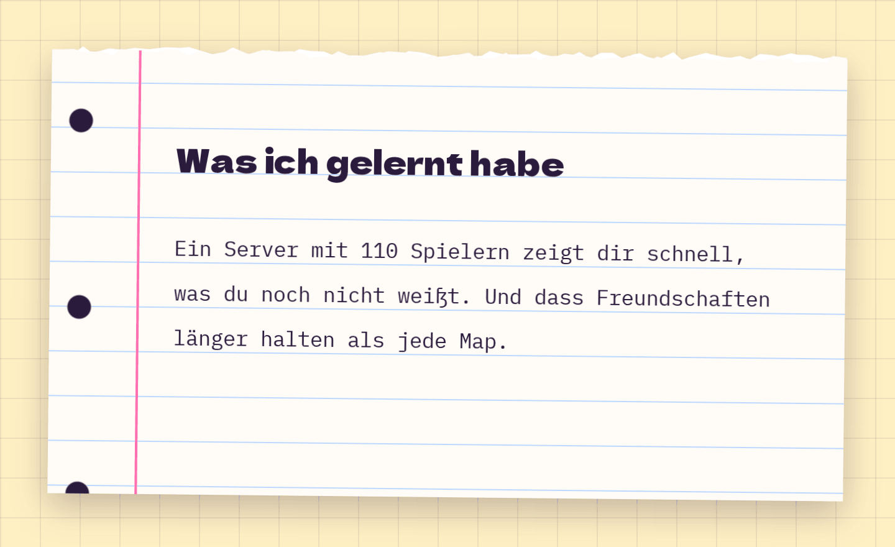</a><br><b><a href="docs/components/Notebook.md">Notebook</a></b><br><sub>Ruled notebook page with a red margin line - long text sits on the lines.</sub></td><td width="33%" valign="top"><a href="docs/components/Icon.md"></a><br><b><a href="docs/components/Icon.md">Icon</a></b><br><sub>Chunky line icon set (plus filled heart, sparkle, star) and the DVN pixel heart.</sub></td><td width="33%" valign="top"><a href="docs/components/PaperPopEffects.md">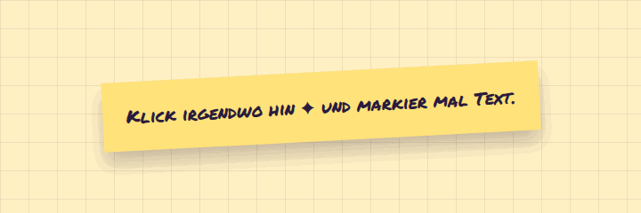</a><br><b><a href="docs/components/PaperPopEffects.md">PaperPopEffects</a></b> ✦<br><sub>Page effects: sparkles on every click and washi tape text selection. Mount once at the app root.</sub></td></tr>
<tr><td width="33%" valign="top"><a href="docs/components/TitleTypewriter.md">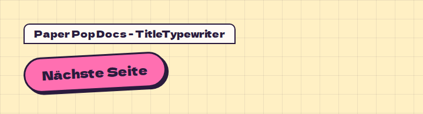</a><br><b><a href="docs/components/TitleTypewriter.md">TitleTypewriter</a></b> ✦<br><sub>Types the browser tab title: the old one is deleted back to the shared beginning, the new one is typed out.</sub></td><td width="33%" valign="top"><a href="docs/components/Confetti.md">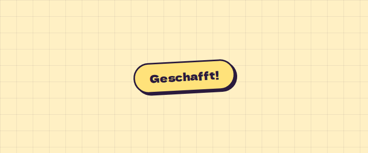</a><br><b><a href="docs/components/Confetti.md">Confetti</a></b> ✦<br><sub>Paper confetti burst - fire it on success moments by changing a counter.</sub></td></tr>
</table>

### Buttons

<table>
<tr><td width="33%" valign="top"><a href="docs/components/Button.md"></a><br><b><a href="docs/components/Button.md">Button</a></b> ✦<br><sub>The chunky, slightly crooked main button with a hard ink shadow. Colours, sizes, icons, loading, link mode.</sub></td><td width="33%" valign="top"><a href="docs/components/Pill.md">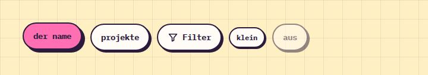</a><br><b><a href="docs/components/Pill.md">Pill</a></b> ✦<br><sub>Outlined rounded secondary button for navigation, filters and secondary actions.</sub></td><td width="33%" valign="top"><a href="docs/components/IconButton.md">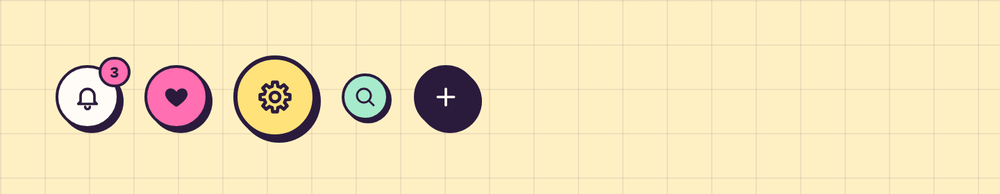</a><br><b><a href="docs/components/IconButton.md">IconButton</a></b><br><sub>Round icon-only button with an optional counter badge.</sub></td></tr>
<tr><td width="33%" valign="top"><a href="docs/components/SegmentedControl.md"></a><br><b><a href="docs/components/SegmentedControl.md">SegmentedControl</a></b> ✦<br><sub>Connected toggle buttons for switching views (Tag / Woche / Monat).</sub></td><td width="33%" valign="top"><a href="docs/components/Fab.md"></a><br><b><a href="docs/components/Fab.md">Fab</a></b> ✦<br><sub>Floating action button - a big round sticker that wiggles for attention.</sub></td><td width="33%" valign="top"><a href="docs/components/CopyButton.md">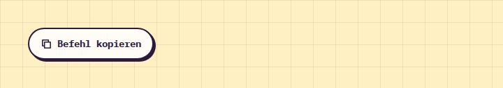</a><br><b><a href="docs/components/CopyButton.md">CopyButton</a></b> ✦<br><sub>Copies text to the clipboard and flips to "Kopiert!" for two seconds.</sub></td></tr>
<tr><td width="33%" valign="top"><a href="docs/components/LikeButton.md"></a><br><b><a href="docs/components/LikeButton.md">LikeButton</a></b> ✦<br><sub>Heart button: a pink wave floods the whole button and sparkles fly across it when liked.</sub></td><td width="33%" valign="top"><a href="docs/components/SocialLinks.md">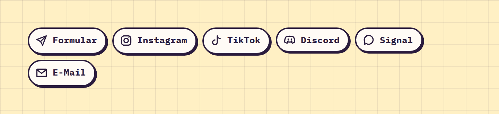</a><br><b><a href="docs/components/SocialLinks.md">SocialLinks</a></b><br><sub>Small chip links for social profiles and contact channels.</sub></td></tr>
</table>

### Forms

<table>
<tr><td width="33%" valign="top"><a href="docs/components/Field.md">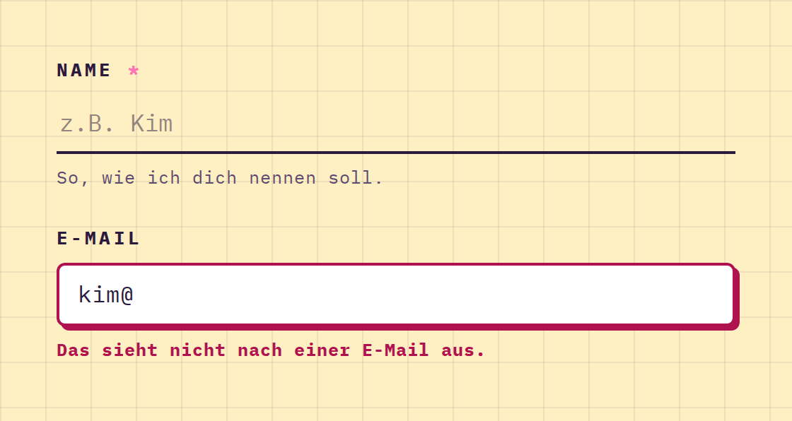</a><br><b><a href="docs/components/Field.md">Field</a></b><br><sub>Label, input and hint/error in one - wires id and aria attributes automatically.</sub></td><td width="33%" valign="top"><a href="docs/components/Input.md">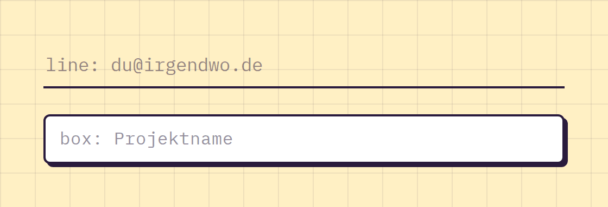</a><br><b><a href="docs/components/Input.md">Input</a></b><br><sub>Text input: ink underline on paper ("line") or a bordered box for apps ("box").</sub></td><td width="33%" valign="top"><a href="docs/components/Textarea.md">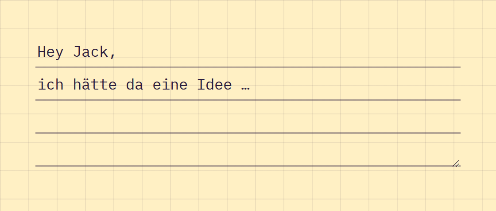</a><br><b><a href="docs/components/Textarea.md">Textarea</a></b><br><sub>Multi-line input that writes on ruled notebook lines.</sub></td></tr>
<tr><td width="33%" valign="top"><a href="docs/components/Checkbox.md"></a><br><b><a href="docs/components/Checkbox.md">Checkbox</a></b> ✦<br><sub>Hand-drawn checkbox with a pink tick that draws itself.</sub></td><td width="33%" valign="top"><a href="docs/components/RadioGroup.md"></a><br><b><a href="docs/components/RadioGroup.md">RadioGroup</a></b> ✦<br><sub>Round hand-drawn radio buttons, vertical or inline.</sub></td><td width="33%" valign="top"><a href="docs/components/Switch.md"></a><br><b><a href="docs/components/Switch.md">Switch</a></b> ✦<br><sub>On/off toggle with a bouncy knob.</sub></td></tr>
<tr><td width="33%" valign="top"><a href="docs/components/Select.md">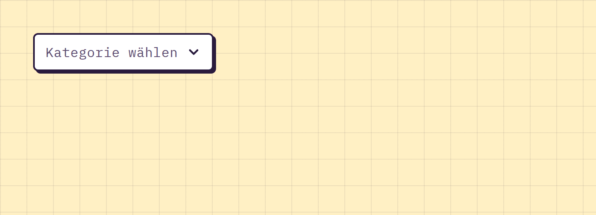</a><br><b><a href="docs/components/Select.md">Select</a></b><br><sub>Custom dropdown with full keyboard support (arrows, Home/End, Enter, Escape, type-ahead) on top of a native select.</sub></td><td width="33%" valign="top"><a href="docs/components/Slider.md">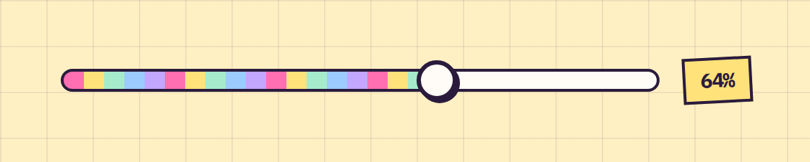</a><br><b><a href="docs/components/Slider.md">Slider</a></b><br><sub>Range slider with a washi tape fill and a value tag.</sub></td><td width="33%" valign="top"><a href="docs/components/SearchInput.md"></a><br><b><a href="docs/components/SearchInput.md">SearchInput</a></b><br><sub>Rounded search field with icon, clear button and shortcut hint.</sub></td></tr>
<tr><td width="33%" valign="top"><a href="docs/components/Rating.md"></a><br><b><a href="docs/components/Rating.md">Rating</a></b> ✦<br><sub>Heart or star rating - interactive or read-only.</sub></td><td width="33%" valign="top"><a href="docs/components/FileDrop.md">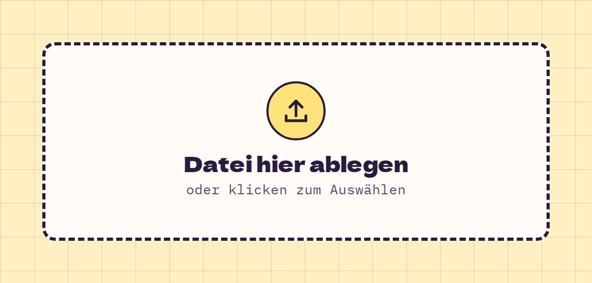</a><br><b><a href="docs/components/FileDrop.md">FileDrop</a></b><br><sub>Dashed drop zone: click or drag files onto it, chosen files appear as removable previews.</sub></td><td width="33%" valign="top"><a href="docs/components/NumberStepper.md">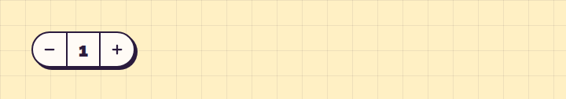</a><br><b><a href="docs/components/NumberStepper.md">NumberStepper</a></b> ✦<br><sub>Minus / value / plus for quantities - click the number to type one.</sub></td></tr>
</table>

### Feedback

<table>
<tr><td width="33%" valign="top"><a href="docs/components/Alert.md"></a><br><b><a href="docs/components/Alert.md">Alert</a></b><br><sub>Taped-on note for info, success, warning and error messages - optionally closable.</sub></td><td width="33%" valign="top"><a href="docs/components/Toast.md">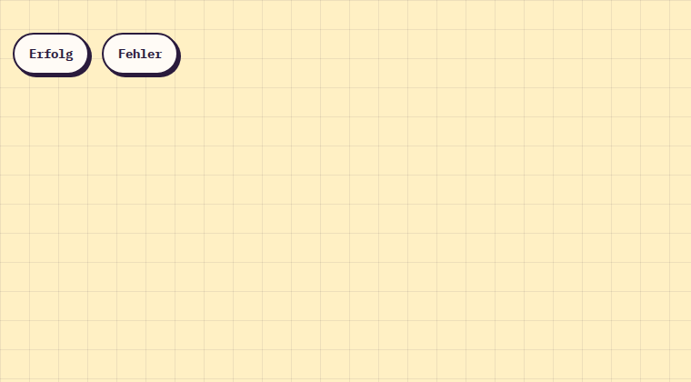</a><br><b><a href="docs/components/Toast.md">Toast</a></b> ✦<br><sub>Little notes that slide in from the corner. Wrap the app in ToastProvider, then call useToast().</sub></td><td width="33%" valign="top"><a href="docs/components/Badge.md">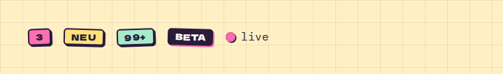</a><br><b><a href="docs/components/Badge.md">Badge</a></b> ✦<br><sub>Small counters and status labels, with dot and pulsing "live" variants.</sub></td></tr>
<tr><td width="33%" valign="top"><a href="docs/components/Tag.md"></a><br><b><a href="docs/components/Tag.md">Tag</a></b><br><sub>Chips for tags, filters and categories - optionally with icon and remove button.</sub></td><td width="33%" valign="top"><a href="docs/components/Progress.md">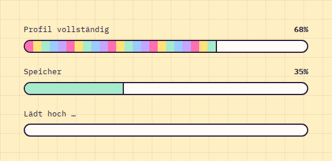</a><br><b><a href="docs/components/Progress.md">Progress</a></b> ✦<br><sub>Progress bar filled with rolling washi tape, or indeterminate while loading.</sub></td><td width="33%" valign="top"><a href="docs/components/Spinner.md"></a><br><b><a href="docs/components/Spinner.md">Spinner</a></b> ✦<br><sub>Three twinkling sparkles circling - the loading indicator.</sub></td></tr>
<tr><td width="33%" valign="top"><a href="docs/components/Skeleton.md">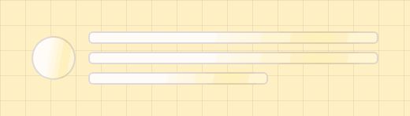</a><br><b><a href="docs/components/Skeleton.md">Skeleton</a></b> ✦<br><sub>Shimmering placeholders while content loads.</sub></td><td width="33%" valign="top"><a href="docs/components/Tooltip.md"></a><br><b><a href="docs/components/Tooltip.md">Tooltip</a></b> ✦<br><sub>Tiny sticky-note tooltip on hover and keyboard focus.</sub></td><td width="33%" valign="top"><a href="docs/components/Modal.md"></a><br><b><a href="docs/components/Modal.md">Modal</a></b> ✦<br><sub>A paper sheet dropping onto a dimmed page. Escape and backdrop close it.</sub></td></tr>
<tr><td width="33%" valign="top"><a href="docs/components/EmptyState.md"></a><br><b><a href="docs/components/EmptyState.md">EmptyState</a></b><br><sub>Friendly "nothing here yet" block for empty lists, inboxes and search results.</sub></td><td width="33%" valign="top"><a href="docs/components/ConsentBanner.md">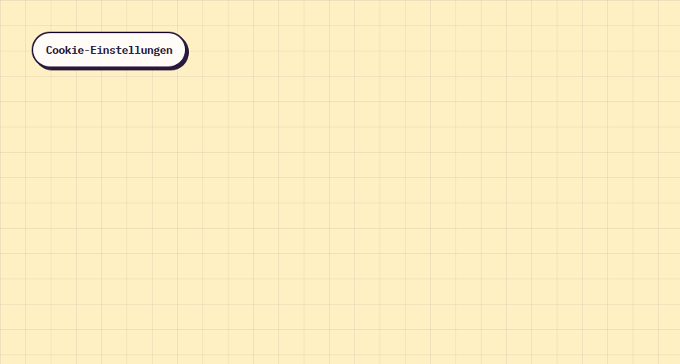</a><br><b><a href="docs/components/ConsentBanner.md">ConsentBanner</a></b> ✦<br><sub>Cookie/consent sticky note in the corner with a dimmed page - you decide where the choice is stored.</sub></td></tr>
</table>

### Navigation

<table>
<tr><td width="33%" valign="top"><a href="docs/components/Navbar.md">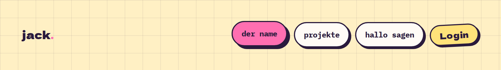</a><br><b><a href="docs/components/Navbar.md">Navbar</a></b><br><sub>Top bar with brand and pill links; turns into a menu button on phones.</sub></td><td width="33%" valign="top"><a href="docs/components/Footer.md">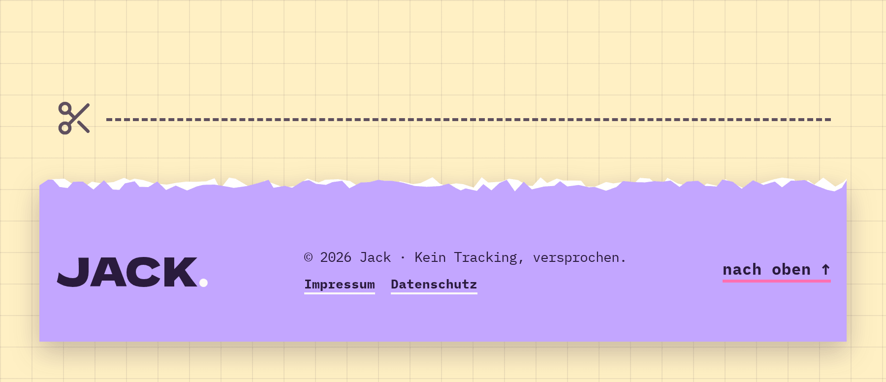</a><br><b><a href="docs/components/Footer.md">Footer</a></b><br><sub>Torn footer strip with brand, note, legal links and a scissors cut line above.</sub></td><td width="33%" valign="top"><a href="docs/components/Tabs.md"></a><br><b><a href="docs/components/Tabs.md">Tabs</a></b> ✦<br><sub>Folder-style index tabs sticking out of a card; arrow keys switch.</sub></td></tr>
<tr><td width="33%" valign="top"><a href="docs/components/Accordion.md"></a><br><b><a href="docs/components/Accordion.md">Accordion</a></b> ✦<br><sub>Folding strips for FAQs and settings groups.</sub></td><td width="33%" valign="top"><a href="docs/components/Breadcrumbs.md">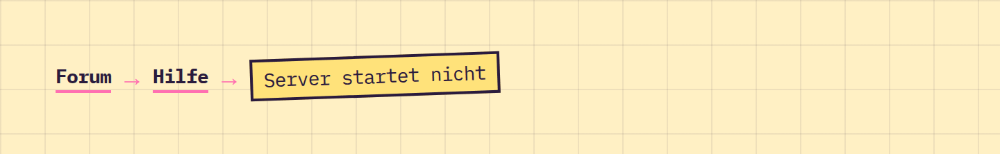</a><br><b><a href="docs/components/Breadcrumbs.md">Breadcrumbs</a></b><br><sub>Path navigation with handwritten arrows; the current page gets a label.</sub></td><td width="33%" valign="top"><a href="docs/components/Pagination.md"></a><br><b><a href="docs/components/Pagination.md">Pagination</a></b><br><sub>Page numbers as crooked paper squares with prev/next arrows.</sub></td></tr>
<tr><td width="33%" valign="top"><a href="docs/components/Sidebar.md"></a><br><b><a href="docs/components/Sidebar.md">Sidebar</a></b><br><sub>Vertical app navigation with sections, icons, badges and a footer.</sub></td><td width="33%" valign="top"><a href="docs/components/Menu.md"></a><br><b><a href="docs/components/Menu.md">Menu</a></b> ✦<br><sub>Dropdown menu on a paper card - keyboard navigation (arrows, Home/End, type-ahead), closes on outside click and Escape.</sub></td><td width="33%" valign="top"><a href="docs/components/Steps.md">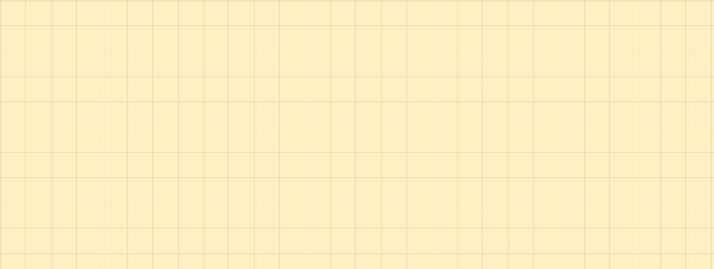</a><br><b><a href="docs/components/Steps.md">Steps</a></b> ✦<br><sub>Numbered torn cards in a row - "how it works" sections. They fly in one after another on scroll.</sub></td></tr>
<tr><td width="33%" valign="top"><a href="docs/components/Timeline.md"></a><br><b><a href="docs/components/Timeline.md">Timeline</a></b><br><sub>Vertical timeline with a dashed line and pastel dots.</sub></td></tr>
</table>

### Layout

<table>
<tr><td width="33%" valign="top"><a href="docs/components/Container.md">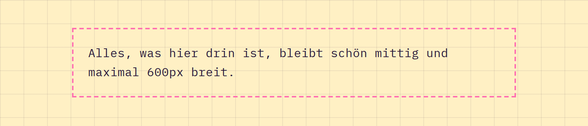</a><br><b><a href="docs/components/Container.md">Container</a></b><br><sub>Centered page column (max 1280px) with a 16px gutter on phones.</sub></td><td width="33%" valign="top"><a href="docs/components/Section.md"></a><br><b><a href="docs/components/Section.md">Section</a></b><br><sub>Page section with kicker, big heading, intro and an aside slot - consistent spacing.</sub></td><td width="33%" valign="top"><a href="docs/components/Stack.md"></a><br><b><a href="docs/components/Stack.md">Stack</a></b><br><sub>Flexbox helper for vertical or horizontal stacks with a gap.</sub></td></tr>
<tr><td width="33%" valign="top"><a href="docs/components/Grid.md">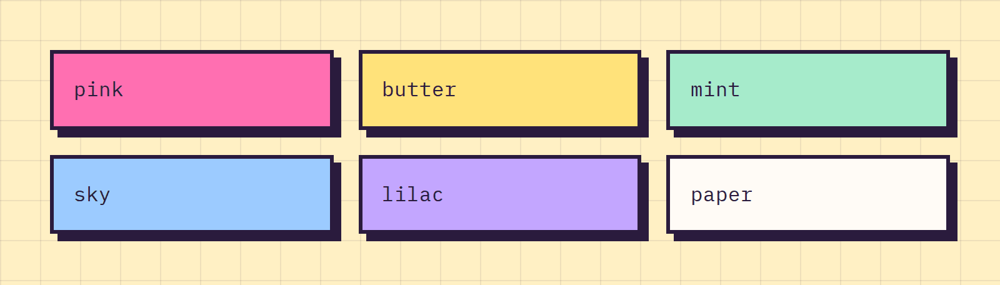</a><br><b><a href="docs/components/Grid.md">Grid</a></b><br><sub>Responsive grid: fixed columns that collapse on small screens, or auto-fit by min width.</sub></td><td width="33%" valign="top"><a href="docs/components/Card.md">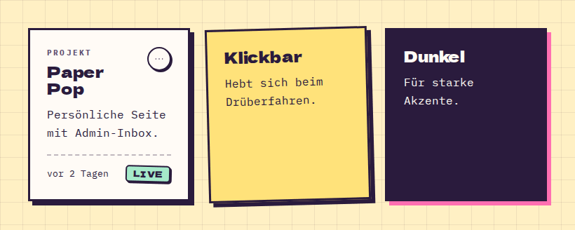</a><br><b><a href="docs/components/Card.md">Card</a></b> ✦<br><sub>Ink-bordered card with a hard shadow for UI - title, eyebrow, actions, footer, hover lift.</sub></td><td width="33%" valign="top"><a href="docs/components/Divider.md"></a><br><b><a href="docs/components/Divider.md">Divider</a></b><br><sub>Horizontal divider: dashed, squiggly or a strip of washi tape, with optional label.</sub></td></tr>
</table>

### Dashboard

<table>
<tr><td width="33%" valign="top"><a href="docs/components/StatCard.md">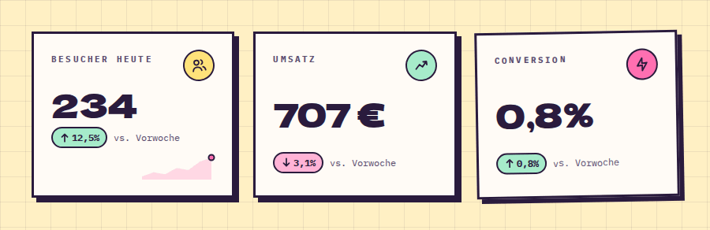</a><br><b><a href="docs/components/StatCard.md">StatCard</a></b> ✦<br><sub>KPI card: label, counting number, delta arrow, icon and sparkline.</sub></td><td width="33%" valign="top"><a href="docs/components/Sparkline.md">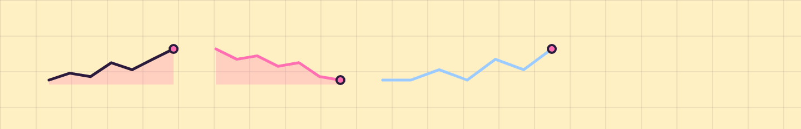</a><br><b><a href="docs/components/Sparkline.md">Sparkline</a></b><br><sub>Tiny inline trend line for cards and tables.</sub></td><td width="33%" valign="top"><a href="docs/components/BarChart.md"></a><br><b><a href="docs/components/BarChart.md">BarChart</a></b> ✦<br><sub>Chunky outlined bars that grow in - vertical or horizontal.</sub></td></tr>
<tr><td width="33%" valign="top"><a href="docs/components/LineChart.md"></a><br><b><a href="docs/components/LineChart.md">LineChart</a></b> ✦<br><sub>Line chart with dashed grid, drawn in like a pen stroke; multiple series with legend.</sub></td><td width="33%" valign="top"><a href="docs/components/DonutChart.md"></a><br><b><a href="docs/components/DonutChart.md">DonutChart</a></b> ✦<br><sub>Donut chart in pastel slices with center value and legend.</sub></td><td width="33%" valign="top"><a href="docs/components/ProgressRing.md"></a><br><b><a href="docs/components/ProgressRing.md">ProgressRing</a></b> ✦<br><sub>Circular progress for goals and quotas in three sizes.</sub></td></tr>
<tr><td width="33%" valign="top"><a href="docs/components/DataTable.md">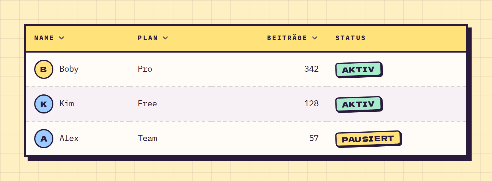</a><br><b><a href="docs/components/DataTable.md">DataTable</a></b><br><sub>Sortable table with sticky header, zebra rows, custom cells and an empty state.</sub></td><td width="33%" valign="top"><a href="docs/components/Avatar.md">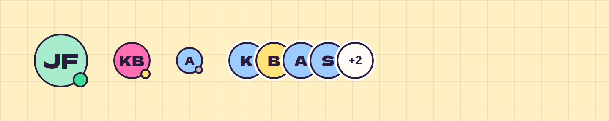</a><br><b><a href="docs/components/Avatar.md">Avatar</a></b><br><sub>Round avatar with image or initials (colour from the name) and status dot, plus overlapping groups.</sub></td><td width="33%" valign="top"><a href="docs/components/Leaderboard.md"></a><br><b><a href="docs/components/Leaderboard.md">Leaderboard</a></b><br><sub>Ranked list - top three get gold, silver and bronze.</sub></td></tr>
<tr><td width="33%" valign="top"><a href="docs/components/ActivityFeed.md">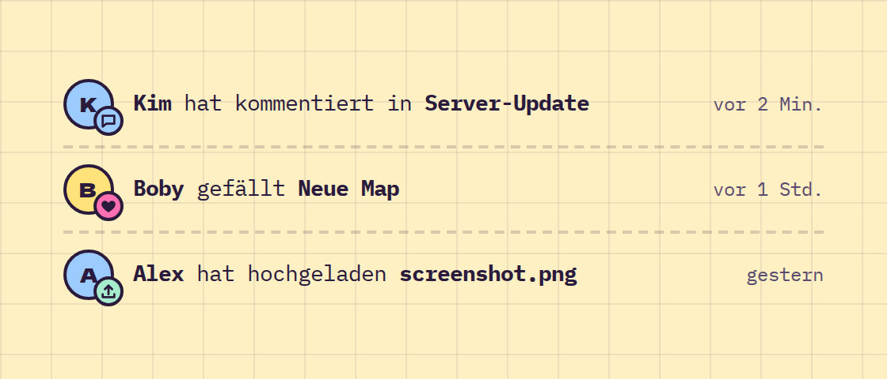</a><br><b><a href="docs/components/ActivityFeed.md">ActivityFeed</a></b><br><sub>"Who did what, when" list with small action icons.</sub></td><td width="33%" valign="top"><a href="docs/components/Heatmap.md">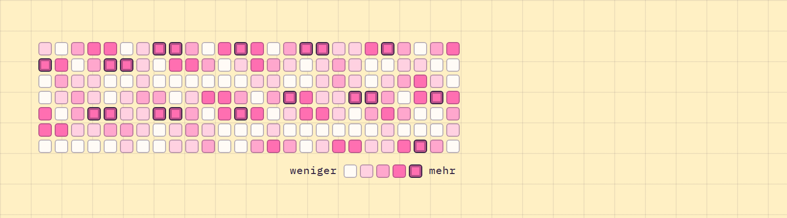</a><br><b><a href="docs/components/Heatmap.md">Heatmap</a></b><br><sub>Contribution-style calendar heatmap with five levels.</sub></td><td width="33%" valign="top"><a href="docs/components/CountUp.md">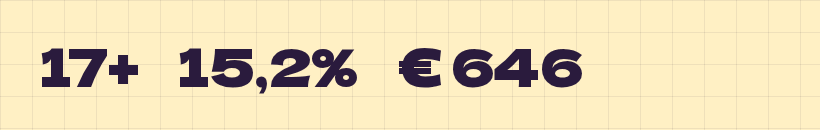</a><br><b><a href="docs/components/CountUp.md">CountUp</a></b> ✦<br><sub>Number that counts up on mount or when the value changes.</sub></td></tr>
</table>

### Landing

<table>
<tr><td width="33%" valign="top"><a href="docs/components/Hero.md">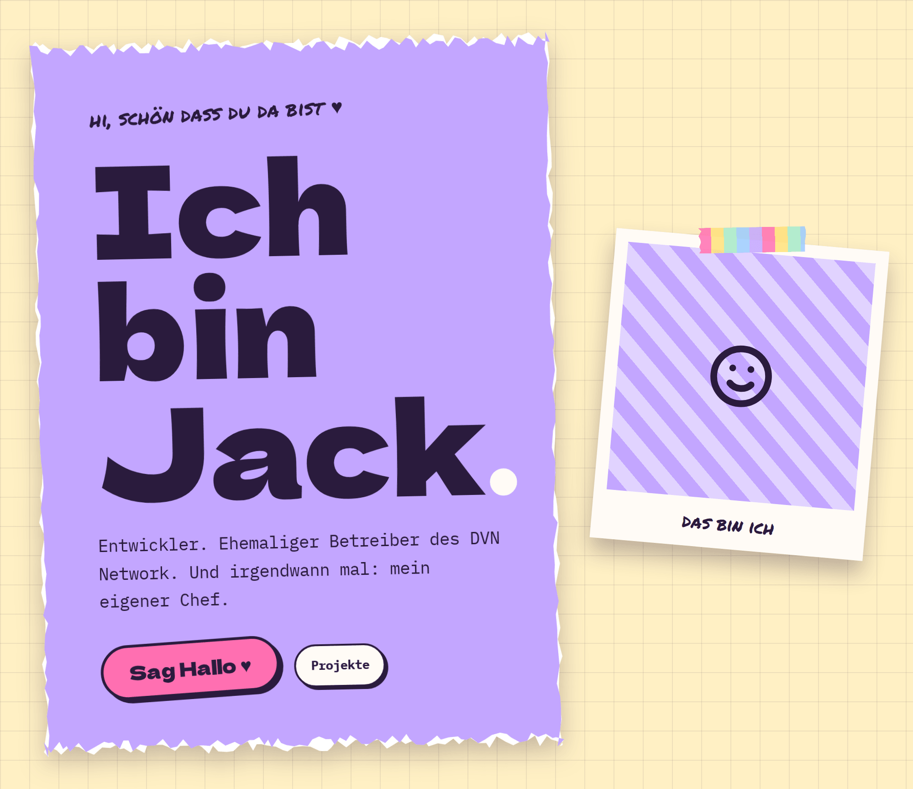</a><br><b><a href="docs/components/Hero.md">Hero</a></b><br><sub>Big torn title sheet with kicker, lead and buttons next to a taped polaroid.</sub></td><td width="33%" valign="top"><a href="docs/components/FeatureGrid.md">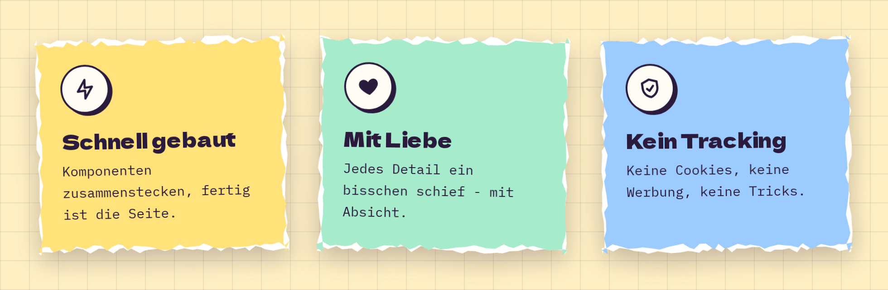</a><br><b><a href="docs/components/FeatureGrid.md">FeatureGrid</a></b><br><sub>Grid of torn feature cards with icon stickers, alternating colours and tilts.</sub></td><td width="33%" valign="top"><a href="docs/components/PricingTable.md"></a><br><b><a href="docs/components/PricingTable.md">PricingTable</a></b><br><sub>Pricing plans side by side; the featured one gets a sticker and a bigger shadow.</sub></td></tr>
<tr><td width="33%" valign="top"><a href="docs/components/Testimonial.md"></a><br><b><a href="docs/components/Testimonial.md">Testimonial</a></b><br><sub>Quote on a taped note with a mini polaroid of the author.</sub></td><td width="33%" valign="top"><a href="docs/components/CtaBanner.md">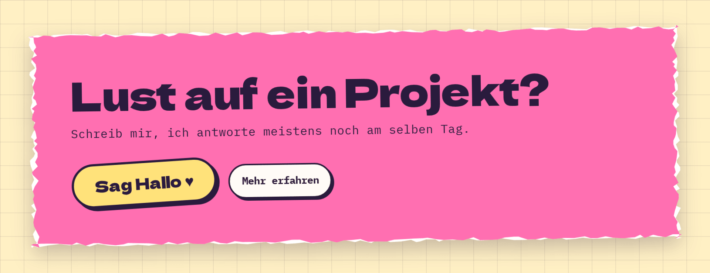</a><br><b><a href="docs/components/CtaBanner.md">CtaBanner</a></b><br><sub>Wide torn banner with headline and buttons - the end-of-page call to action.</sub></td><td width="33%" valign="top"><a href="docs/components/Newsletter.md">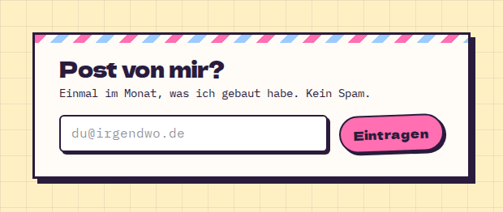</a><br><b><a href="docs/components/Newsletter.md">Newsletter</a></b> ✦<br><sub>E-mail signup card with airmail stripes and a success stamp.</sub></td></tr>
<tr><td width="33%" valign="top"><a href="docs/components/PolaroidStack.md"></a><br><b><a href="docs/components/PolaroidStack.md">PolaroidStack</a></b> ✦<br><sub>A pile of polaroids that fans out on hover (on scroll into view on touch devices).</sub></td><td width="33%" valign="top"><a href="docs/components/Marquee.md">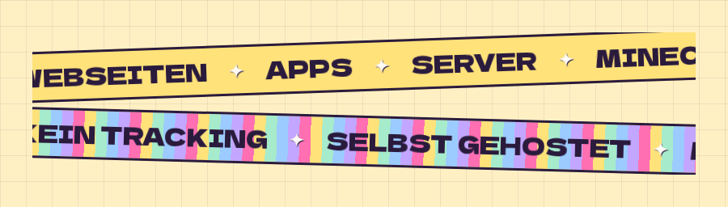</a><br><b><a href="docs/components/Marquee.md">Marquee</a></b> ✦<br><sub>Endless strip of tape with scrolling words - between sections or as a ticker.</sub></td><td width="33%" valign="top"><a href="docs/components/LinkCard.md"></a><br><b><a href="docs/components/LinkCard.md">LinkCard</a></b> ✦<br><sub>Link-in-bio row on a torn card with icon, title and subtitle - links, external profiles or copy-a-username.</sub></td></tr>
<tr><td width="33%" valign="top"><a href="docs/components/LogoCloud.md">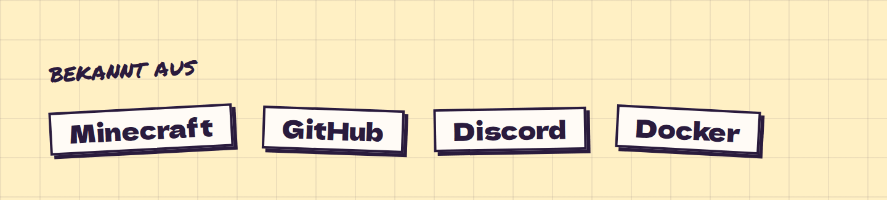</a><br><b><a href="docs/components/LogoCloud.md">LogoCloud</a></b><br><sub>"Known from" row with image logos or label-maker text tags.</sub></td></tr>
</table>

### Forum

<table>
<tr><td width="33%" valign="top"><a href="docs/components/ThreadCard.md">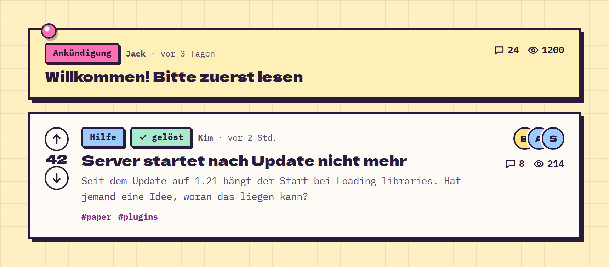</a><br><b><a href="docs/components/ThreadCard.md">ThreadCard</a></b><br><sub>Forum thread in a list: votes, category, title, excerpt, tags, participants and counters.</sub></td><td width="33%" valign="top"><a href="docs/components/Post.md"></a><br><b><a href="docs/components/Post.md">Post</a></b><br><sub>Full forum post with author header, role badge, body, reactions and actions; can be marked as best answer.</sub></td><td width="33%" valign="top"><a href="docs/components/Comment.md">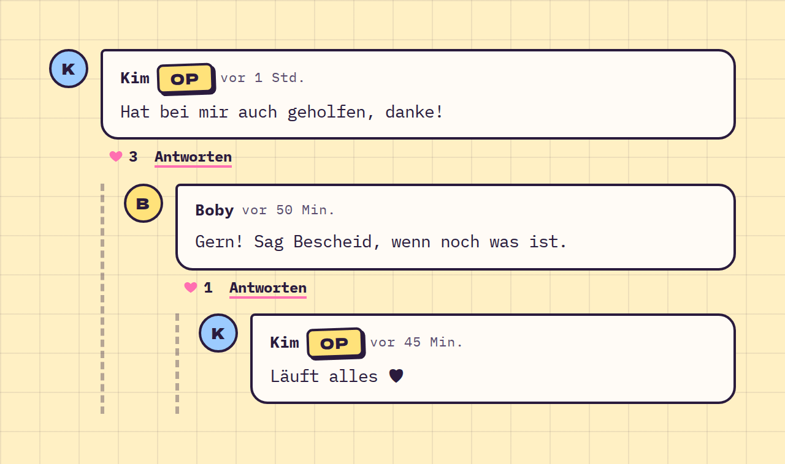</a><br><b><a href="docs/components/Comment.md">Comment</a></b><br><sub>Threaded comments with a dashed reply line - nest Comments as children.</sub></td></tr>
<tr><td width="33%" valign="top"><a href="docs/components/VoteButtons.md">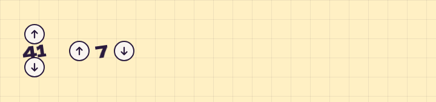</a><br><b><a href="docs/components/VoteButtons.md">VoteButtons</a></b> ✦<br><sub>Up/down voting with a bouncy score, vertical or horizontal.</sub></td><td width="33%" valign="top"><a href="docs/components/Reactions.md"></a><br><b><a href="docs/components/Reactions.md">Reactions</a></b> ✦<br><sub>Toggleable reaction chips with counts.</sub></td><td width="33%" valign="top"><a href="docs/components/Composer.md">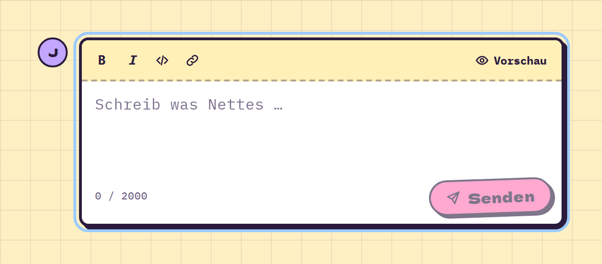</a><br><b><a href="docs/components/Composer.md">Composer</a></b><br><sub>Reply box with live markdown formatting, toolbar, preview, character counter and send button.</sub></td></tr>
<tr><td width="33%" valign="top"><a href="docs/components/UserCard.md"></a><br><b><a href="docs/components/UserCard.md">UserCard</a></b><br><sub>Profile card with polaroid avatar, badges, bio, stats and actions.</sub></td><td width="33%" valign="top"><a href="docs/components/CategoryCard.md"></a><br><b><a href="docs/components/CategoryCard.md">CategoryCard</a></b><br><sub>Board/category tile with icon, description and thread/post counters.</sub></td></tr>
</table>

### Apps

<table>
<tr><td width="33%" valign="top"><a href="docs/components/AppShell.md"></a><br><b><a href="docs/components/AppShell.md">AppShell</a></b><br><sub>Dashboard frame: sidebar left, top bar and content right; the sidebar slides in on phones.</sub></td><td width="33%" valign="top"><a href="docs/components/ChatThread.md"></a><br><b><a href="docs/components/ChatThread.md">ChatThread</a></b> ✦<br><sub>Chat with grouped bubbles, typing indicator and input row. In this demo Kim and Boby answer whatever you send.</sub></td><td width="33%" valign="top"><a href="docs/components/KanbanBoard.md">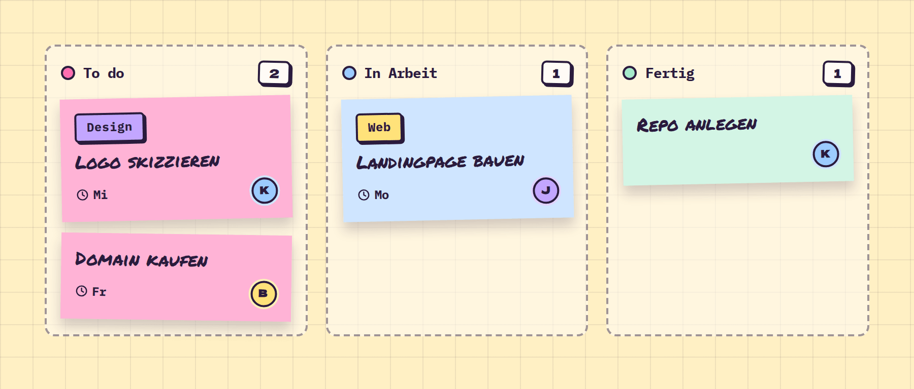</a><br><b><a href="docs/components/KanbanBoard.md">KanbanBoard</a></b><br><sub>Drag-and-drop board of sticky notes in columns.</sub></td></tr>
<tr><td width="33%" valign="top"><a href="docs/components/MiniCalendar.md"></a><br><b><a href="docs/components/MiniCalendar.md">MiniCalendar</a></b><br><sub>Month calendar on a tear-off pad with selected day, today marker and event dots. Click the month to jump to any month and year.</sub></td><td width="33%" valign="top"><a href="docs/components/Checklist.md">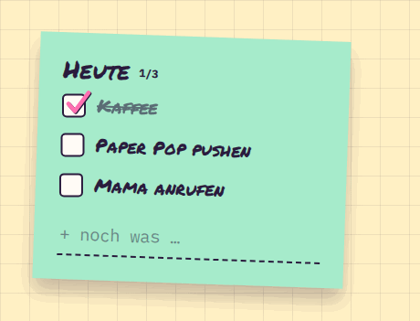</a><br><b><a href="docs/components/Checklist.md">Checklist</a></b> ✦<br><sub>To-do list on a sticky note - tick items off, optionally add new ones.</sub></td><td width="33%" valign="top"><a href="docs/components/Kbd.md">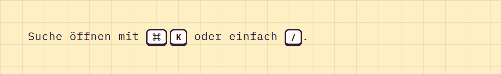</a><br><b><a href="docs/components/Kbd.md">Kbd</a></b><br><sub>Keyboard key caps for shortcuts.</sub></td></tr>
<tr><td width="33%" valign="top"><a href="docs/components/CodeBlock.md"></a><br><b><a href="docs/components/CodeBlock.md">CodeBlock</a></b><br><sub>Code snippet with file tab and copy button - language is detected automatically, 20 languages in 8 colour styles.</sub></td><td width="33%" valign="top"><a href="docs/components/Drawer.md">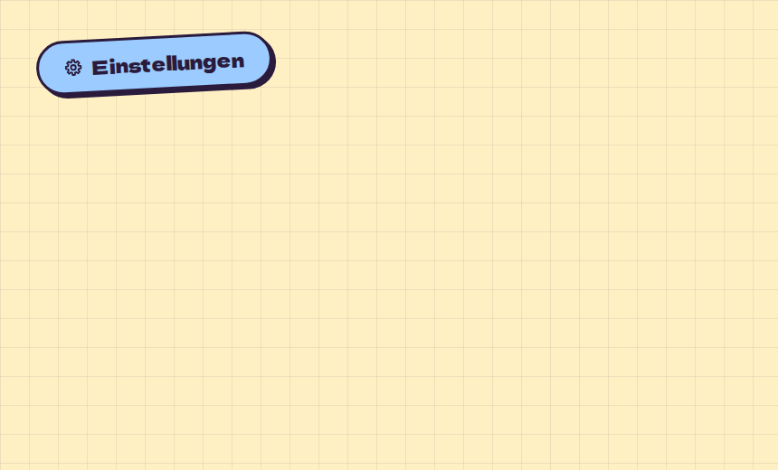</a><br><b><a href="docs/components/Drawer.md">Drawer</a></b> ✦<br><sub>A sheet of paper sliding in from the side - filters, details, settings.</sub></td></tr>
</table>

<!-- COMPONENTS:END -->

## License

[MIT](LICENSE) - use it for anything, commercial or not. Keep the copyright notice, and if you like it, a link back to [iamjustjack.de](https://iamjustjack.de) is always very welcome.

## For agents

The live docs publish machine-readable versions for AI agents: [`/llms.txt`](https://paperpop.iamjustjack.de/llms.txt) (index), [`/llms-full.txt`](https://paperpop.iamjustjack.de/llms-full.txt) (all docs in one file) and [`/components.json`](https://paperpop.iamjustjack.de/components.json) (manifest with props and examples). For Claude Code use the MCP server above.
