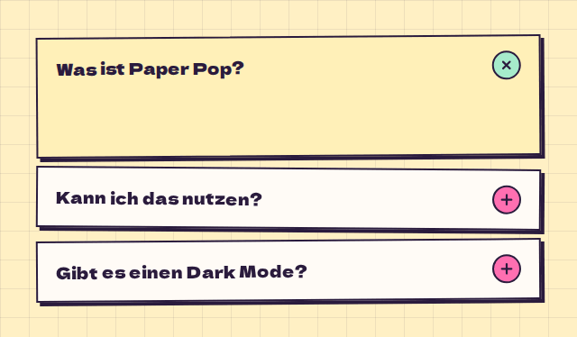

# Accordion

**Navigation** · [all components](../../README.md#components) · animated

Folding strips for FAQs and settings groups.



## Usage

```tsx
import { Accordion } from 'paperpop';

<Accordion defaultOpen={['a']} items={[
  { id: 'a', title: 'Was ist Paper Pop?', content: 'Die Komponenten-Bibliothek hinter iamjustjack.de - zerrissenes Papier, Pastell und Polaroids.' },
  { id: 'b', title: 'Kann ich das nutzen?', content: 'Klar, als Git-Submodule in jede Vite + React Seite.' },
  { id: 'c', title: 'Gibt es einen Dark Mode?', content: 'Noch nicht. Papier ist hell.' },
]} />
```

## Props

### Accordion

| Prop | Type | Default | Description |
| --- | --- | --- | --- |
| `items` * | `AccordionItem[]` |  | Sections. |
| `multiple` | `boolean` |  | Allow several open sections. |
| `defaultOpen` | `string[]` |  | Initially open ids. |

Also accepts: `HTMLAttributes<HTMLDivElement>` (native attributes are passed through).

\* required

## Source

- Component: [`src/components/navigation.tsx`](../../src/components/navigation.tsx)
- Example: [`stories/navigation.stories.tsx`](../../stories/navigation.stories.tsx)

<!-- Generated by scripts/docs.ts - edit the component or its story, not this file. -->
