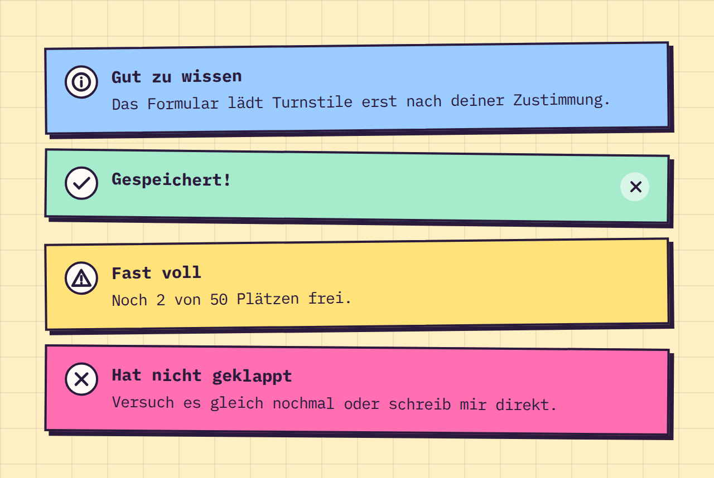

# Alert

**Feedback** · [all components](../../README.md#components)

Taped-on note for info, success, warning and error messages - optionally closable.



## Usage

```tsx
import { Alert } from 'paperpop';

<div style={{ display: 'grid', gap: 18 }}>
  <Alert title="Gut zu wissen">Das Formular lädt Turnstile erst nach deiner Zustimmung.</Alert>
  <Alert status="success" title="Gespeichert!" tilt={0.6} onClose={() => {}} />
  <Alert status="warning" title="Fast voll">Noch 2 von 50 Plätzen frei.</Alert>
  <Alert status="error" title="Hat nicht geklappt" tilt={0.4}>Versuch es gleich nochmal oder schreib mir direkt.</Alert>
</div>
```

## Props

### Alert

| Prop | Type | Default | Description |
| --- | --- | --- | --- |
| `status` | `Status` | `'info'` | Kind of message; sets colour and icon. |
| `title` | `ReactNode` |  | Bold first line. |
| `onClose` | `() => void` |  | Shows a close button that calls this. |
| `tilt` | `number` | `-0.6` | Rotation in degrees. |

Also accepts: `Omit<HTMLAttributes<HTMLDivElement>, 'title'>` (native attributes are passed through).

\* required

## Source

- Component: [`src/components/feedback.tsx`](../../src/components/feedback.tsx)
- Example: [`stories/feedback.stories.tsx`](../../stories/feedback.stories.tsx)

<!-- Generated by scripts/docs.ts - edit the component or its story, not this file. -->
