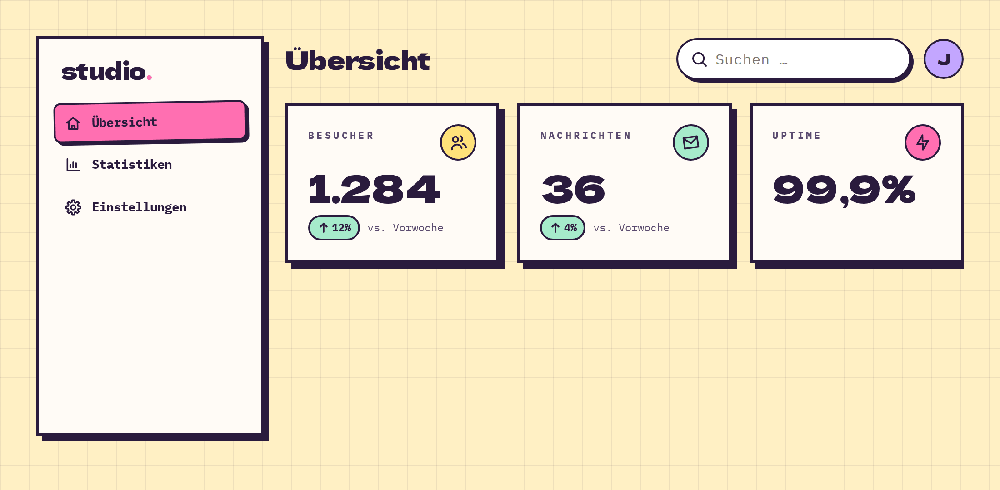

# AppShell

**Apps** · [all components](../../README.md#components)

Dashboard frame: sidebar left, top bar and content right; the sidebar slides in on phones.



## Usage

```tsx
import { AppShell, Avatar, SearchInput, Sidebar, StatCard } from 'paperpop';

<div style={{ height: 460, overflow: 'hidden' }}>
  <AppShell
    style={{ minHeight: 0, padding: 0 }}
    sidebar={<Sidebar brand="studio" style={{ height: 440 }} sections={[{ links: [{ label: 'Übersicht', href: '#', icon: 'home', active: true }, { label: 'Statistiken', href: '#s', icon: 'chart' }, { label: 'Einstellungen', href: '#e', icon: 'settings' }] }]} />}
    topbar={<><h1 className="pp-display" style={{ fontSize: 28, flex: 1 }}>Übersicht</h1><SearchInput value="" onChange={() => {}} /><Avatar name="Jack" /></>}
  >
    <div style={{ display: 'grid', gridTemplateColumns: 'repeat(auto-fit, minmax(180px, 1fr))', gap: 20 }}>
      <StatCard label="Besucher" value="1.284" delta={12} icon="users" />
      <StatCard label="Nachrichten" value="36" delta={4} icon="mail" color="mint" />
      <StatCard label="Uptime" value="99,9" suffix="%" icon="zap" color="pink" />
    </div>
  </AppShell>
</div>
```

## Props

### AppShell

| Prop | Type | Default | Description |
| --- | --- | --- | --- |
| `sidebar` * | `ReactNode` |  | Left navigation, usually a &lt;Sidebar>. Hidden behind a menu button on small screens. |
| `topbar` | `ReactNode` |  | Top bar content (title, search, avatar). |
| `children` * | `ReactNode` |  | Page content. |

Also accepts: `HTMLAttributes<HTMLDivElement>` (native attributes are passed through).

\* required

## Source

- Component: [`src/components/apps.tsx`](../../src/components/apps.tsx)
- Example: [`stories/apps.stories.tsx`](../../stories/apps.stories.tsx)

<!-- Generated by scripts/docs.ts - edit the component or its story, not this file. -->
