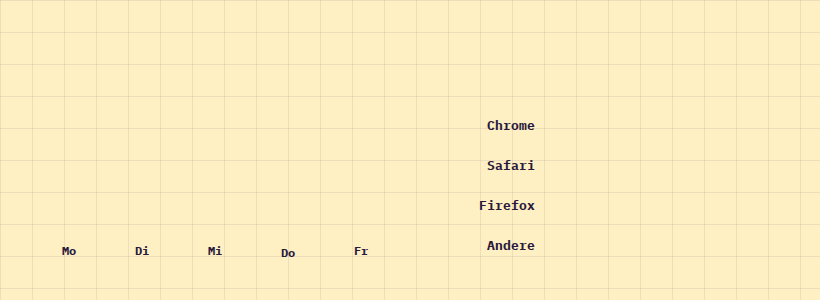

# BarChart

**Dashboard** · [all components](../../README.md#components) · animated

Chunky outlined bars that grow in - vertical or horizontal.



## Usage

```tsx
import { BarChart } from 'paperpop';

<div style={{ display: 'grid', gridTemplateColumns: 'repeat(auto-fit, minmax(260px, 1fr))', gap: 40, alignItems: 'end' }}>
  <BarChart data={[{ label: 'Mo', value: 120 }, { label: 'Di', value: 180 }, { label: 'Mi', value: 90 }, { label: 'Do', value: 240 }, { label: 'Fr', value: 200 }]} />
  <BarChart horizontal data={[{ label: 'Chrome', value: 62 }, { label: 'Safari', value: 24 }, { label: 'Firefox', value: 9 }, { label: 'Andere', value: 5 }]} format={(v) => `${v}%`} />
</div>
```

## Props

### BarChart

| Prop | Type | Default | Description |
| --- | --- | --- | --- |
| `data` * | `BarDatum[]` |  | Bars. |
| `height` | `number` | `220` | Chart height in px (vertical) or bar thickness (horizontal). |
| `horizontal` | `boolean` |  | Lay bars out horizontally (good for long labels / rankings). |
| `format` | `(v: number) => string` |  | Format the value labels. |
| `label` | `string` | `'Balkendiagramm'` | Accessible summary. |

Also accepts: `HTMLAttributes<HTMLDivElement>` (native attributes are passed through).

\* required

## Source

- Component: [`src/components/dashboard.tsx`](../../src/components/dashboard.tsx)
- Example: [`stories/dashboard.stories.tsx`](../../stories/dashboard.stories.tsx)

<!-- Generated by scripts/docs.ts - edit the component or its story, not this file. -->
