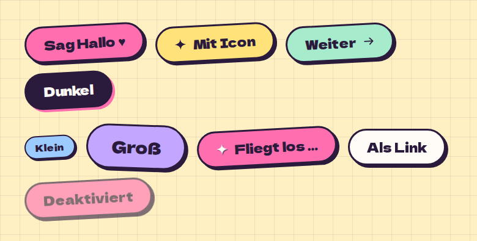

# Button

**Buttons** · [all components](../../README.md#components) · animated

The chunky, slightly crooked main button with a hard ink shadow. Colours, sizes, icons, loading, link mode.



## Usage

```tsx
import { Button } from 'paperpop';

<div style={{ display: 'grid', gap: 26 }}>
  <div style={{ display: 'flex', gap: 18, flexWrap: 'wrap', alignItems: 'center' }}>
    <Button>Sag Hallo ♥</Button>
    <Button color="butter" icon="sparkle">Mit Icon</Button>
    <Button color="mint" iconRight="arrow-right">Weiter</Button>
    <Button color="ink">Dunkel</Button>
  </div>
  <div style={{ display: 'flex', gap: 18, flexWrap: 'wrap', alignItems: 'center' }}>
    <Button size="sm" color="sky">Klein</Button>
    <Button size="lg" color="lilac" tilt={2}>Groß</Button>
    <Button loading color="pink">Fliegt los …</Button>
    <Button href="#" color="paper" tilt={0}>Als Link</Button>
    <Button disabled>Deaktiviert</Button>
  </div>
</div>
```

## Props

### Button

| Prop | Type | Default | Description |
| --- | --- | --- | --- |
| `color` | `Tone` | `'pink'` | Fill colour. |
| `size` | `Size` | `'md'` | Size. |
| `tilt` | `number` | `-3` | Rotation in degrees - the slightly crooked look. |
| `icon` | `IconName` |  | Icon before the label. |
| `iconRight` | `IconName` |  | Icon after the label. |
| `loading` | `boolean` |  | Shows a spinning sparkle and disables the button. |
| `block` | `boolean` |  | Full width. |

Also accepts: `Clickable` (native attributes are passed through).

\* required

## Source

- Component: [`src/components/buttons.tsx`](../../src/components/buttons.tsx)
- Example: [`stories/buttons.stories.tsx`](../../stories/buttons.stories.tsx)

<!-- Generated by scripts/docs.ts - edit the component or its story, not this file. -->
