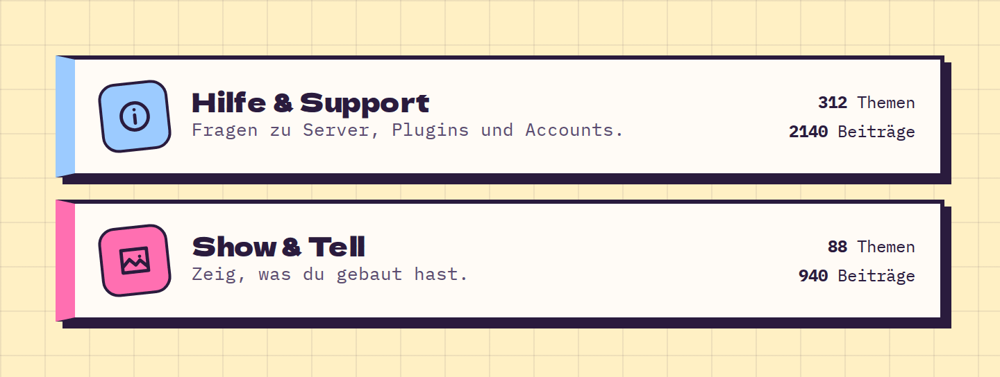

# CategoryCard

**Forum** · [all components](../../README.md#components)

Board/category tile with icon, description and thread/post counters.



## Usage

```tsx
import { CategoryCard } from 'paperpop';

<div style={{ display: 'grid', gap: 16 }}>
  <CategoryCard href="#help" icon="info" title="Hilfe & Support" description="Fragen zu Server, Plugins und Accounts." threads={312} posts={2140} />
  <CategoryCard href="#show" icon="image" color="pink" title="Show & Tell" description="Zeig, was du gebaut hast." threads={88} posts={940} />
</div>
```

## Props

### CategoryCard

| Prop | Type | Default | Description |
| --- | --- | --- | --- |
| `title` * | `ReactNode` |  | Category name. |
| `description` | `ReactNode` |  | Description. |
| `icon` * | `IconName` |  | Icon. |
| `color` | `PaperColor` | `'sky'` | Colour. |
| `threads` | `number` |  | Thread count. |
| `posts` | `number` |  | Post count. |
| `href` * | `string` |  | Link. |

Also accepts: `Omit<HTMLAttributes<HTMLAnchorElement>, 'title'>` (native attributes are passed through).

\* required

## Source

- Component: [`src/components/forum.tsx`](../../src/components/forum.tsx)
- Example: [`stories/forum.stories.tsx`](../../stories/forum.stories.tsx)

<!-- Generated by scripts/docs.ts - edit the component or its story, not this file. -->
