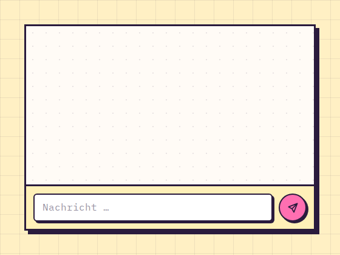

# ChatThread

**Apps** · [all components](../../README.md#components) · animated

Chat with grouped bubbles, typing indicator and input row. In this demo Kim and Boby answer whatever you send.



## Usage

```tsx
import { useState, useRef } from 'react';
import { ChatThread, ChatMessage } from 'paperpop';

function Example() {
  const [messages, setMessages] = useState<ChatMessage[]>([
    { id: 1, author: 'Kim', text: 'Hey! Bist du heute Abend online?', time: '18:02' },
    { id: 2, author: 'Kim', text: 'Wir wollten die neue Map testen.', time: '18:02' },
    { id: 3, author: 'Jack', text: 'Klar, ab 20 Uhr ♥', time: '18:05', own: true },
  ]);
  const [typing, setTyping] = useState<string>();
  const replies = useRef([['Kim', 'Haha, stimmt ♥'], ['Boby', 'Bin gleich da!'], ['Kim', 'Das probier ich direkt aus ✨'], ['Boby', 'Sag ich doch 😄'], ['Kim', 'Warte, ich schau kurz nach …']] as const);
  const n = useRef(0);
  function send(text: string) {
    setMessages((m) => [...m, { id: Date.now(), author: 'Jack', text, own: true }]);
    const [who, answer] = replies.current[n.current++ % replies.current.length]!;
    setTimeout(() => setTyping(who), 500);
    setTimeout(() => {
      setTyping(undefined);
      setMessages((m) => [...m, { id: Date.now() + 1, author: who, text: answer }]);
    }, 500 + 900 + answer.length * 30);
  }
  return <ChatThread height={260} messages={messages} typing={typing} onSend={send} />;
}
```

## Props

### ChatThread

| Prop | Type | Default | Description |
| --- | --- | --- | --- |
| `messages` * | `ChatMessage[]` |  | Messages, oldest first. |
| `onSend` | `(text: string) => void` |  | Called when the user sends a message. Omit to hide the input. |
| `typing` | `string` |  | Shows "… tippt" at the bottom. |
| `height` | `number` | `380` | Height of the scroll area. |

Also accepts: `Omit<HTMLAttributes<HTMLDivElement>, 'onSubmit'>` (native attributes are passed through).

\* required

### ChatBubble

| Prop | Type | Default | Description |
| --- | --- | --- | --- |
| `message` * | `ChatMessage` |  |  |
| `compact` | `boolean` |  | Hide avatar and name (for consecutive messages). |

Also accepts: `HTMLAttributes<HTMLDivElement>` (native attributes are passed through).

\* required

## Source

- Component: [`src/components/apps.tsx`](../../src/components/apps.tsx)
- Example: [`stories/apps.stories.tsx`](../../stories/apps.stories.tsx)

<!-- Generated by scripts/docs.ts - edit the component or its story, not this file. -->
