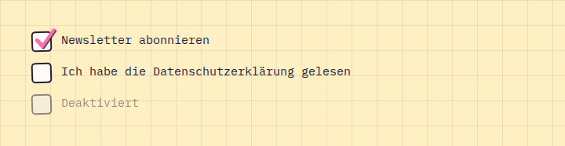

# Checkbox

**Forms** · [all components](../../README.md#components) · animated

Hand-drawn checkbox with a pink tick that draws itself.



## Usage

```tsx
import { Checkbox } from 'paperpop';

<div style={{ display: 'grid', gap: 14 }}>
  <Checkbox label="Newsletter abonnieren" defaultChecked />
  <Checkbox label="Ich habe die Datenschutzerklärung gelesen" />
  <Checkbox label="Deaktiviert" disabled />
</div>
```

## Props

### Checkbox

| Prop | Type | Default | Description |
| --- | --- | --- | --- |
| `label` * | `ReactNode` |  | Label next to the box. |

Also accepts: `Omit<InputHTMLAttributes<HTMLInputElement>, 'type'>` (native attributes are passed through).

\* required

## Source

- Component: [`src/components/forms.tsx`](../../src/components/forms.tsx)
- Example: [`stories/forms.stories.tsx`](../../stories/forms.stories.tsx)

<!-- Generated by scripts/docs.ts - edit the component or its story, not this file. -->
