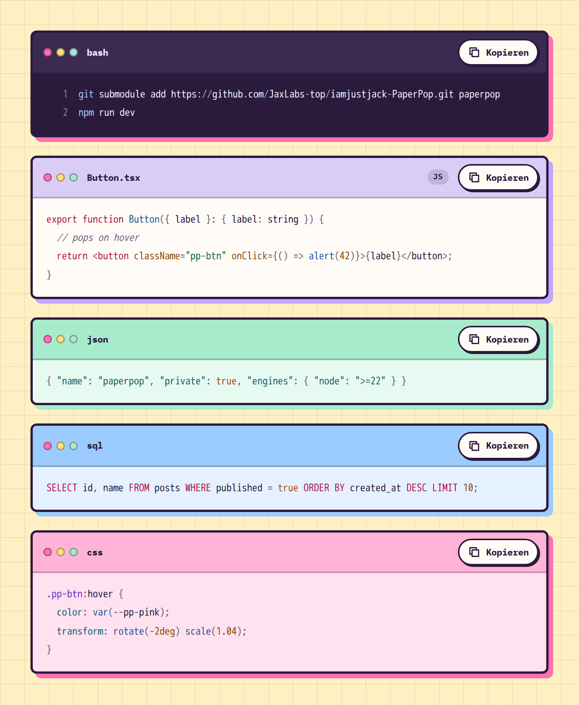

# CodeBlock

**Apps** · [all components](../../README.md#components)

Code snippet with file tab and copy button - language is detected automatically, 20 languages in 8 colour styles.



## Usage

```tsx
import { Button, CodeBlock } from 'paperpop';

<div style={{ display: 'grid', gap: 24 }}>
  <CodeBlock lineNumbers code={'git submodule add https://github.com/JaxLabs-top/iamjustjack-PaperPop.git paperpop\nnpm run dev'} />
  <CodeBlock theme="paper" title="Button.tsx" code={'export function Button({ label }: { label: string }) {\n  // pops on hover\n  return <button className="pp-btn" onClick={() => alert(42)}>{label}</button>;\n}'} />
  <CodeBlock theme="mint" code={'{ "name": "paperpop", "private": true, "engines": { "node": ">=22" } }'} />
  <CodeBlock theme="sky" code={'SELECT id, name FROM posts WHERE published = true ORDER BY created_at DESC LIMIT 10;'} />
  <CodeBlock theme="pink" code={'.pp-btn:hover {\n  color: var(--pp-pink);\n  transform: rotate(-2deg) scale(1.04);\n}'} />
</div>
```

## Notes

Leave `language` on "auto" and the block detects TypeScript/JSX, JSON, HTML, CSS, shell, Python, Go, Rust, Java, C#, C/C++, PHP, Ruby, SQL, YAML, TOML, Markdown, diff and Dockerfile; aliases such as `ts`, `sh`, `yml` also work. `theme` is `ink` (dark, default), `paper`, `pink`, `butter`, `mint`, `sky`, `lilac` or `auto` (follows the system light/dark setting).

## Props

### CodeBlock

| Prop | Type | Default | Description |
| --- | --- | --- | --- |
| `code` * | `string` |  | The code. |
| `title` | `string` |  | Label in the tab (file name or language). Defaults to the language. |
| `copy` | `boolean` | `true` | Show a copy button. |
| `lineNumbers` | `boolean` |  | Show line numbers. |
| `language` | `CodeLanguage` | `'auto'` | Language for highlighting. "auto" detects it from the code; common names and aliases (ts, tsx, sh, yml, c++ ...) work. |
| `theme` | `CodeTheme` | `'ink'` | Colour style. "ink" is dark, the pastels are light, "auto" follows the system light/dark setting. |

Also accepts: `HTMLAttributes<HTMLDivElement>` (native attributes are passed through).

\* required

## Source

- Component: [`src/components/apps.tsx`](../../src/components/apps.tsx)
- Example: [`stories/apps.stories.tsx`](../../stories/apps.stories.tsx)

<!-- Generated by scripts/docs.ts - edit the component or its story, not this file. -->
