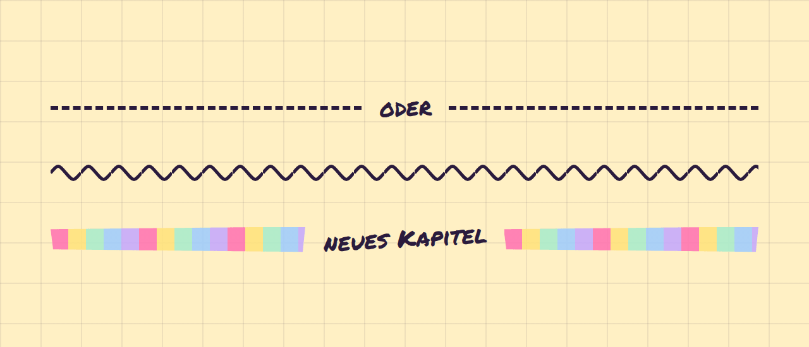

# Divider

**Layout** · [all components](../../README.md#components)

Horizontal divider: dashed, squiggly or a strip of washi tape, with optional label.



## Usage

```tsx
import { Divider } from 'paperpop';

<div>
  <Divider label="oder" />
  <Divider variant="squiggle" />
  <Divider variant="washi" label="neues Kapitel" />
</div>
```

## Props

### Divider

| Prop | Type | Default | Description |
| --- | --- | --- | --- |
| `variant` | `'dashed' \| 'squiggle' \| 'washi'` | `'dashed'` | Line style. |
| `label` | `ReactNode` |  | Text in the middle. |

Also accepts: `HTMLAttributes<HTMLDivElement>` (native attributes are passed through).

\* required

## Source

- Component: [`src/components/layout.tsx`](../../src/components/layout.tsx)
- Example: [`stories/layout.stories.tsx`](../../stories/layout.stories.tsx)

<!-- Generated by scripts/docs.ts - edit the component or its story, not this file. -->
