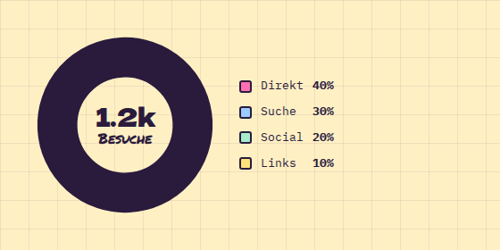

# DonutChart

**Dashboard** · [all components](../../README.md#components) · animated

Donut chart in pastel slices with center value and legend.



## Usage

```tsx
import { DonutChart } from 'paperpop';

<DonutChart center="1.2k" centerLabel="Besuche" data={[
  { label: 'Direkt', value: 480 }, { label: 'Suche', value: 360 }, { label: 'Social', value: 240 }, { label: 'Links', value: 120 },
]} />
```

## Props

### DonutChart

| Prop | Type | Default | Description |
| --- | --- | --- | --- |
| `data` * | `BarDatum[]` |  | Slices. |
| `size` | `number` | `200` | Diameter in px. |
| `center` | `ReactNode` |  | Big text in the middle (defaults to the total). |
| `centerLabel` | `ReactNode` |  | Small text under the center value. |
| `legend` | `boolean` | `true` | Show the legend with percentages. |

Also accepts: `HTMLAttributes<HTMLDivElement>` (native attributes are passed through).

\* required

## Source

- Component: [`src/components/dashboard.tsx`](../../src/components/dashboard.tsx)
- Example: [`stories/dashboard.stories.tsx`](../../stories/dashboard.stories.tsx)

<!-- Generated by scripts/docs.ts - edit the component or its story, not this file. -->
