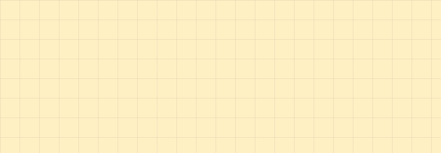

# Doodle

**Foundations** · [all components](../../README.md#components) · animated

Hand-drawn arrows, circles, squiggles, stars and hearts that draw themselves in.



## Usage

```tsx
import { Doodle } from 'paperpop';

<div style={{ display: 'flex', gap: 30, alignItems: 'center', flexWrap: 'wrap' }}>
  <Doodle kind="arrow" />
  <Doodle kind="curly-arrow" color="var(--pp-pink)" />
  <Doodle kind="circle" />
  <Doodle kind="squiggle" color="var(--pp-sky)" size={150} />
  <Doodle kind="star" size={60} color="var(--pp-pink)" />
  <Doodle kind="heart" size={60} />
  <Doodle kind="burst" size={60} />
  <Doodle kind="spiral" size={60} color="var(--pp-lilac)" />
</div>
```

## Props

### Doodle

| Prop | Type | Default | Description |
| --- | --- | --- | --- |
| `kind` * | `DoodleKind` |  | What to scribble. |
| `color` | `string` | `'var(--pp-ink)'` | Stroke colour (any CSS colour). |
| `size` | `number` | `120` | Width in px, height follows the doodle's aspect ratio. |
| `tilt` | `number` | `0` | Rotation in degrees. |
| `animate` | `boolean` | `true` | Draw the line on mount. |

Also accepts: `Omit<HTMLAttributes<HTMLSpanElement>, 'color'>` (native attributes are passed through).

\* required

## Source

- Component: [`src/components/foundations.tsx`](../../src/components/foundations.tsx)
- Example: [`stories/foundations.stories.tsx`](../../stories/foundations.stories.tsx)

<!-- Generated by scripts/docs.ts - edit the component or its story, not this file. -->
