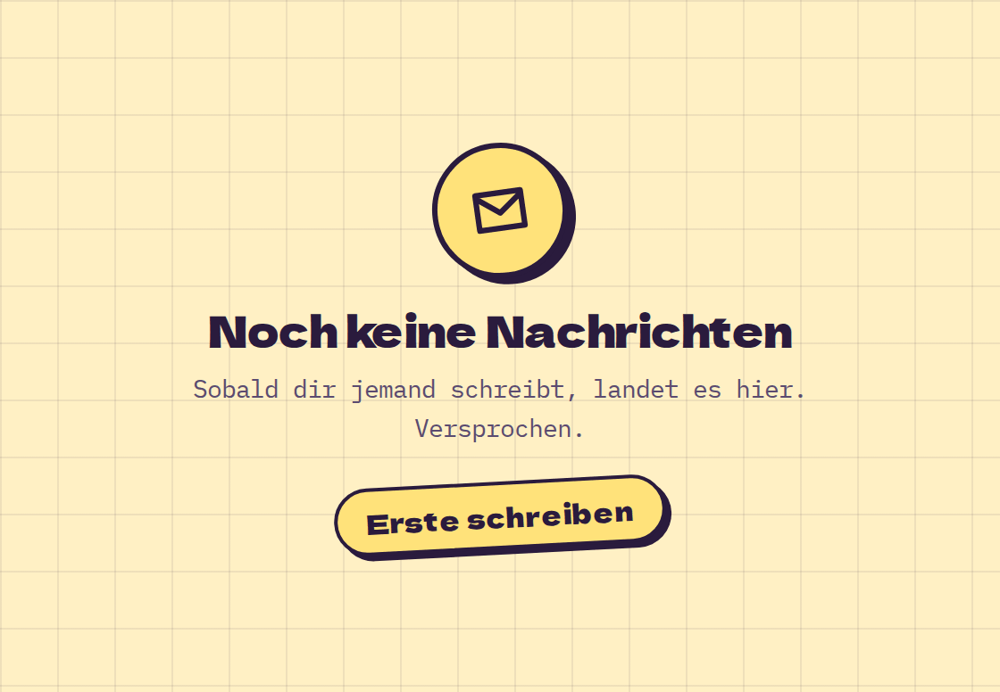

# EmptyState

**Feedback** · [all components](../../README.md#components)

Friendly "nothing here yet" block for empty lists, inboxes and search results.



## Usage

```tsx
import { Button, EmptyState } from 'paperpop';

<EmptyState icon="mail" title="Noch keine Nachrichten" action={<Button size="sm" color="butter">Erste schreiben</Button>}>
  Sobald dir jemand schreibt, landet es hier. Versprochen.
</EmptyState>
```

## Props

### EmptyState

| Prop | Type | Default | Description |
| --- | --- | --- | --- |
| `icon` | `IconName` | `'sparkle'` | Icon in the circle. |
| `title` * | `ReactNode` |  | Headline. |
| `children` | `ReactNode` |  | Explanation. |
| `action` | `ReactNode` |  | Button(s). |

Also accepts: `Omit<HTMLAttributes<HTMLDivElement>, 'title'>` (native attributes are passed through).

\* required

## Source

- Component: [`src/components/feedback.tsx`](../../src/components/feedback.tsx)
- Example: [`stories/feedback.stories.tsx`](../../stories/feedback.stories.tsx)

<!-- Generated by scripts/docs.ts - edit the component or its story, not this file. -->
