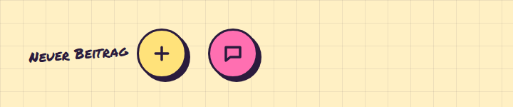

# Fab

**Buttons** · [all components](../../README.md#components) · animated

Floating action button - a big round sticker that wiggles for attention.



## Usage

```tsx
import { Fab } from 'paperpop';

<div style={{ display: 'flex', flexWrap: 'wrap', gap: 30, alignItems: 'center' }}>
  <Fab label="Neuer Beitrag" hint />
  <Fab icon="chat" label="Chat öffnen" color="pink" />
</div>
```

## Props

### Fab

| Prop | Type | Default | Description |
| --- | --- | --- | --- |
| `icon` | `IconName` | `'plus'` | Icon. |
| `label` * | `string` |  | Accessible label; also shown as a handwritten hint when `hint` is set. |
| `hint` | `boolean` |  | Show the label as a handwritten note next to the button. |
| `color` | `Tone` | `'butter'` | Colour. |
| `fixed` | `boolean` |  | Stick to the bottom right corner of the viewport. |

Also accepts: `Clickable` (native attributes are passed through).

\* required

## Source

- Component: [`src/components/buttons.tsx`](../../src/components/buttons.tsx)
- Example: [`stories/buttons.stories.tsx`](../../stories/buttons.stories.tsx)

<!-- Generated by scripts/docs.ts - edit the component or its story, not this file. -->
