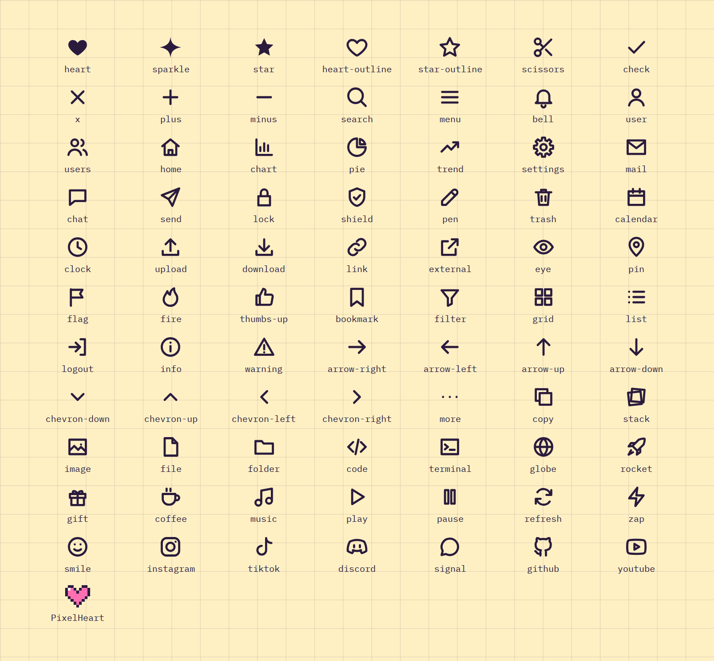

# Icon

**Foundations** · [all components](../../README.md#components)

Chunky line icon set (plus filled heart, sparkle, star) and the DVN pixel heart.



## Usage

```tsx
import { Icon, ICON_NAMES, PixelHeart } from 'paperpop';

<div style={{ display: 'grid', gridTemplateColumns: 'repeat(auto-fill, minmax(84px, 1fr))', gap: 10 }}>
  {ICON_NAMES.map((n) => (
    <div key={n} style={{ display: 'grid', justifyItems: 'center', gap: 4, fontSize: 10 }}>
      <Icon name={n} size={26} />
      {n}
    </div>
  ))}
  <div style={{ display: 'grid', justifyItems: 'center', gap: 4, fontSize: 10 }}><PixelHeart size={28} style={{ color: 'var(--pp-pink)' }} />PixelHeart</div>
</div>
```

## Notes

All icon names are exported as `ICON_NAMES`. Icons inherit `color`; pass `label` to make an icon meaningful for screen readers.

## Props

### Icon

| Prop | Type | Default | Description |
| --- | --- | --- | --- |
| `name` * | `IconName` |  | Which icon to draw. |
| `size` | `number` | `24` | Width and height in px. |
| `stroke` | `number` | `2.2` | Stroke width for line icons. |
| `label` | `string` |  | Accessible label. Without it the icon is decorative (aria-hidden). |

Also accepts: `Omit<SVGProps<SVGSVGElement>, 'name' \| 'stroke'>` (native attributes are passed through).

\* required

## Source

- Component: [`src/components/Icon.tsx`](../../src/components/Icon.tsx)
- Example: [`stories/foundations.stories.tsx`](../../stories/foundations.stories.tsx)

<!-- Generated by scripts/docs.ts - edit the component or its story, not this file. -->
