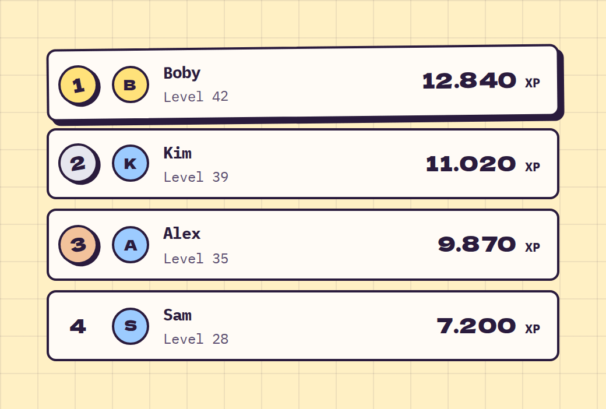

# Leaderboard

**Dashboard** · [all components](../../README.md#components)

Ranked list - top three get gold, silver and bronze.



## Usage

```tsx
import { Leaderboard } from 'paperpop';

<Leaderboard unit="XP" items={[
  { name: 'Boby', value: 12840, meta: 'Level 42' },
  { name: 'Kim', value: 11020, meta: 'Level 39' },
  { name: 'Alex', value: 9870, meta: 'Level 35' },
  { name: 'Sam', value: 7200, meta: 'Level 28' },
]} />
```

## Props

### Leaderboard

| Prop | Type | Default | Description |
| --- | --- | --- | --- |
| `items` * | `Array<{ name: string; value: number \| string; src?: string; meta?: ReactNode }>` |  | Entries, already sorted. |
| `unit` | `string` |  | Unit after the value. |

Also accepts: `HTMLAttributes<HTMLOListElement>` (native attributes are passed through).

\* required

## Source

- Component: [`src/components/dashboard.tsx`](../../src/components/dashboard.tsx)
- Example: [`stories/dashboard.stories.tsx`](../../stories/dashboard.stories.tsx)

<!-- Generated by scripts/docs.ts - edit the component or its story, not this file. -->
