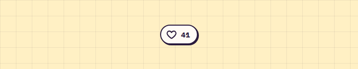

# LikeButton

**Buttons** · [all components](../../README.md#components) · animated

Heart button: a pink wave floods the whole button and sparkles fly across it when liked.



## Usage

```tsx
import { LikeButton } from 'paperpop';

<div style={{ display: 'grid', placeItems: 'center', minHeight: 60 }}>
  <LikeButton count={41} />
</div>
```

## Props

### LikeButton

| Prop | Type | Default | Description |
| --- | --- | --- | --- |
| `liked` | `boolean` |  | Current like state (controlled). Leave undefined to let the button manage itself. |
| `count` | `number` | `0` | Like count before the user's own like. |
| `onChange` | `(liked: boolean) => void` |  | Called with the new state. |
| `label` | `string` | `'Gefällt mir'` | Accessible label. |

Also accepts: `Omit<ButtonHTMLAttributes<HTMLButtonElement>, 'onChange'>` (native attributes are passed through).

\* required

## Source

- Component: [`src/components/buttons.tsx`](../../src/components/buttons.tsx)
- Example: [`stories/buttons.stories.tsx`](../../stories/buttons.stories.tsx)

<!-- Generated by scripts/docs.ts - edit the component or its story, not this file. -->
