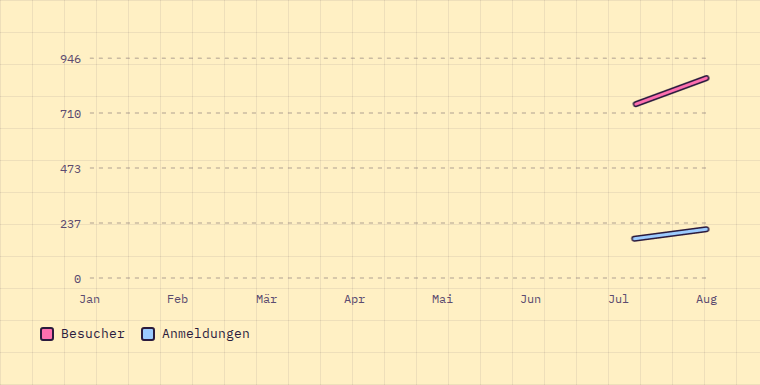

# LineChart

**Dashboard** · [all components](../../README.md#components) · animated

Line chart with dashed grid, drawn in like a pen stroke; multiple series with legend.



## Usage

```tsx
import { LineChart } from 'paperpop';

<LineChart
  labels={['Jan', 'Feb', 'Mär', 'Apr', 'Mai', 'Jun', 'Jul', 'Aug']}
  series={[
    { name: 'Besucher', values: [320, 410, 380, 520, 610, 580, 720, 860] },
    { name: 'Anmeldungen', values: [40, 60, 55, 90, 120, 110, 160, 210], color: 'sky' },
  ]}
/>
```

## Props

### LineChart

| Prop | Type | Default | Description |
| --- | --- | --- | --- |
| `series` * | `LineSeries[]` |  | One or more series with the same length as `labels`. |
| `labels` * | `string[]` |  | X axis labels. |
| `height` | `number` | `240` | Height in px. |
| `area` | `boolean` | `true` | Fill the area under the first series. |
| `legend` | `boolean` | `true when there are 2+ series` | Show the legend. |
| `label` | `string` | `'Liniendiagramm'` | Accessible summary. |

Also accepts: `HTMLAttributes<HTMLDivElement>` (native attributes are passed through).

\* required

## Source

- Component: [`src/components/dashboard.tsx`](../../src/components/dashboard.tsx)
- Example: [`stories/dashboard.stories.tsx`](../../stories/dashboard.stories.tsx)

<!-- Generated by scripts/docs.ts - edit the component or its story, not this file. -->
