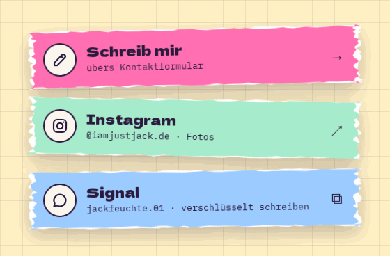

# LinkCard

**Landing** · [all components](../../README.md#components) · animated

Link-in-bio row on a torn card with icon, title and subtitle - links, external profiles or copy-a-username.



## Usage

```tsx
import { LinkCard } from 'paperpop';

<div style={{ display: 'grid', gap: 18 }}>
  <LinkCard href="/#contact" icon="pen" title="Schreib mir" subtitle="übers Kontaktformular" tilt={-1.2} />
  <LinkCard href="https://www.instagram.com/" icon="instagram" title="Instagram" subtitle="@iamjustjack.de · Fotos" color="mint" edge="card-2" tilt={0.9} />
  <LinkCard copyText="jackfeuchte.01" icon="signal" title="Signal" subtitle="jackfeuchte.01 · verschlüsselt schreiben" color="sky" edge="card-3" tilt={-0.6} />
</div>
```

## Props

### LinkCard

| Prop | Type | Default | Description |
| --- | --- | --- | --- |
| `icon` * | `IconName` |  | Icon in the circle. |
| `title` * | `ReactNode` |  | Main line. |
| `subtitle` | `ReactNode` |  | Second line (handle, hint). |
| `action` | `ReactNode` | `'→' ('↗' for external links, '⧉' for copy cards)` | Small glyph on the right. |
| `href` | `string` |  | Link target. |
| `copyText` | `string` |  | Copy this text to the clipboard instead of navigating (for Discord/Signal names). |
| `newTab` | `boolean` | `true for http(s) links` | Open in a new tab. |
| `color` | `PaperColor` | `'pink'` | Sheet colour. |
| `edge` | `TornEdge` | `'card-1'` | Torn edge. |
| `tilt` | `number` | `0` | Rotation in degrees. |

Also accepts: `Omit<HTMLAttributes<HTMLElement>, 'title'>` (native attributes are passed through).

\* required

## Source

- Component: [`src/components/landing.tsx`](../../src/components/landing.tsx)
- Example: [`stories/landing.stories.tsx`](../../stories/landing.stories.tsx)

<!-- Generated by scripts/docs.ts - edit the component or its story, not this file. -->
