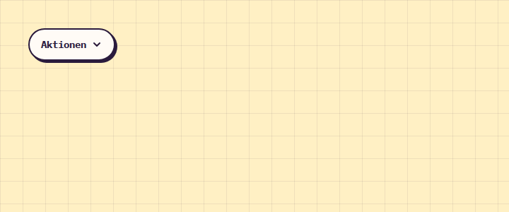

# Menu

**Navigation** · [all components](../../README.md#components) · animated

Dropdown menu on a paper card - keyboard navigation (arrows, Home/End, type-ahead), closes on outside click and Escape.



## Usage

```tsx
import { Menu } from 'paperpop';

<Menu trigger="Aktionen" items={[
  { label: 'Bearbeiten', icon: 'pen' },
  { label: 'Teilen', icon: 'link' },
  { label: 'Anpinnen', icon: 'pin' },
  { label: 'Löschen', icon: 'trash', danger: true, divider: true },
]} />
```

## Props

### Menu

| Prop | Type | Default | Description |
| --- | --- | --- | --- |
| `trigger` * | `ReactNode` |  | Content of the trigger button. |
| `label` | `string` |  | Accessible label for icon-only triggers. |
| `items` * | `MenuItem[]` |  | Entries. |
| `align` | `'left' \| 'right'` | `'left'` | Which edge the menu aligns to. |
| `iconTrigger` | `boolean` |  | Render the trigger as a round icon button. |
| `className` | `string` |  |  |

\* required

## Source

- Component: [`src/components/navigation.tsx`](../../src/components/navigation.tsx)
- Example: [`stories/navigation.stories.tsx`](../../stories/navigation.stories.tsx)

<!-- Generated by scripts/docs.ts - edit the component or its story, not this file. -->
