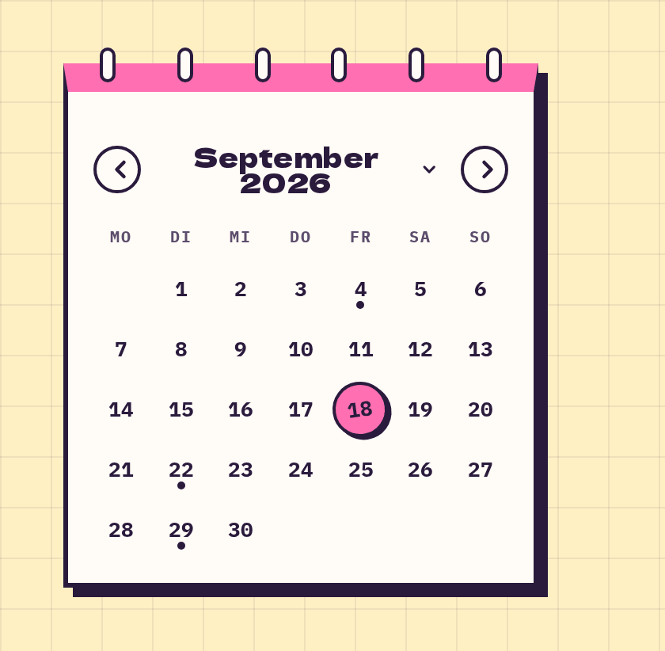

# MiniCalendar

**Apps** · [all components](../../README.md#components)

Month calendar on a tear-off pad with selected day, today marker and event dots. Click the month to jump to any month and year.



## Usage

```tsx
import { useState } from 'react';
import { MiniCalendar } from 'paperpop';

function Example() {
  const [day, setDay] = useState(new Date(2026, 8, 18));
  return <MiniCalendar value={day} onChange={setDay} marked={[new Date(2026, 8, 4), new Date(2026, 8, 22), new Date(2026, 8, 29)]} />;
}
```

## Notes

In the month picker you can type the year, use the arrow keys or scroll with the mouse wheel.

## Props

### MiniCalendar

| Prop | Type | Default | Description |
| --- | --- | --- | --- |
| `value` | `Date` |  | Selected date. |
| `onChange` | `(date: Date) => void` |  | Called with the clicked date. |
| `marked` | `Date[]` |  | Dates with a dot (events). |
| `month` | `Date` | `value or today` | Month shown initially. |

Also accepts: `Omit<HTMLAttributes<HTMLDivElement>, 'onChange'>` (native attributes are passed through).

\* required

## Source

- Component: [`src/components/apps.tsx`](../../src/components/apps.tsx)
- Example: [`stories/apps.stories.tsx`](../../stories/apps.stories.tsx)

<!-- Generated by scripts/docs.ts - edit the component or its story, not this file. -->
