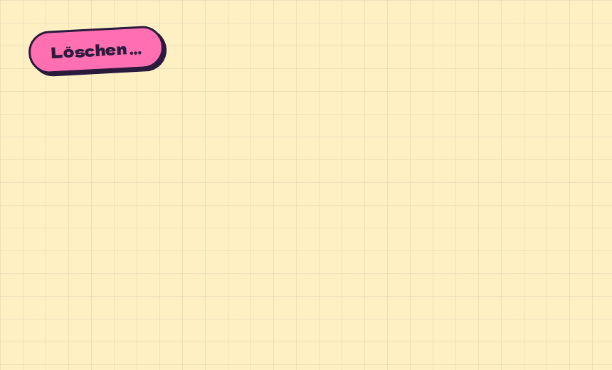

# Modal

**Feedback** · [all components](../../README.md#components) · animated

A paper sheet dropping onto a dimmed page. Escape and backdrop close it.



## Usage

```tsx
import { useState } from 'react';
import { Button, Modal, Pill } from 'paperpop';

function Example() {
  const [open, setOpen] = useState(false);
  return (
    <>
      <Button onClick={() => setOpen(true)}>Löschen …</Button>
      <Modal open={open} onClose={() => setOpen(false)} title="Wirklich löschen?"
        actions={<><Button color="pink" onClick={() => setOpen(false)}>Ja, weg damit</Button><Pill onClick={() => setOpen(false)}>Abbrechen</Pill></>}>
        <p>Der Beitrag „Mein erstes Plugin“ und alle 12 Antworten werden gelöscht. Das lässt sich nicht rückgängig machen.</p>
      </Modal>
    </>
  );
}
```

## Props

### Modal

| Prop | Type | Default | Description |
| --- | --- | --- | --- |
| `open` * | `boolean` |  | Visible or not. |
| `onClose` * | `() => void` |  | Called on backdrop click, Escape or the close button. |
| `title` * | `ReactNode` |  | Big heading. |
| `children` | `ReactNode` |  | Content. |
| `actions` | `ReactNode` |  | Buttons at the bottom. |
| `color` | `PaperColor` | `'paper'` | Sheet colour. |
| `width` | `number` | `520` | Max width in px. |

\* required

## Source

- Component: [`src/components/feedback.tsx`](../../src/components/feedback.tsx)
- Example: [`stories/feedback.stories.tsx`](../../stories/feedback.stories.tsx)

<!-- Generated by scripts/docs.ts - edit the component or its story, not this file. -->
