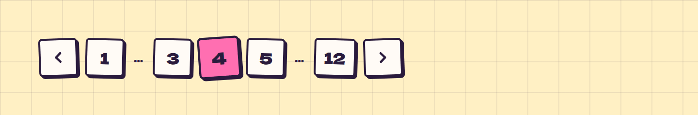

# Pagination

**Navigation** · [all components](../../README.md#components)

Page numbers as crooked paper squares with prev/next arrows.



## Usage

```tsx
import { useState } from 'react';
import { Pagination } from 'paperpop';

function Example() {
  const [page, setPage] = useState(4);
  return <Pagination page={page} pages={12} onChange={setPage} />;
}
```

## Props

### Pagination

| Prop | Type | Default | Description |
| --- | --- | --- | --- |
| `page` * | `number` |  | Current page (1-based). |
| `pages` * | `number` |  | Total number of pages. |
| `onChange` * | `(page: number) => void` |  | Called with the new page. |

Also accepts: `Omit<HTMLAttributes<HTMLElement>, 'onChange'>` (native attributes are passed through).

\* required

## Source

- Component: [`src/components/navigation.tsx`](../../src/components/navigation.tsx)
- Example: [`stories/navigation.stories.tsx`](../../stories/navigation.stories.tsx)

<!-- Generated by scripts/docs.ts - edit the component or its story, not this file. -->
