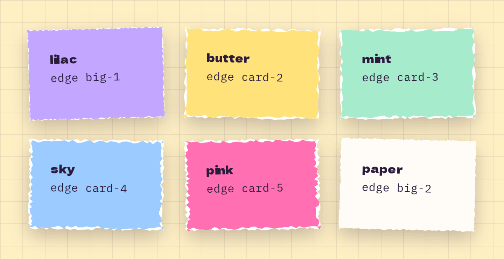

# Paper

**Foundations** · [all components](../../README.md#components)

Torn sheet of paper with a white rim - the core surface for heroes, sections and cards.



## Usage

```tsx
import { Paper } from 'paperpop';

<div style={{ display: 'grid', gridTemplateColumns: 'repeat(auto-fit, minmax(180px, 1fr))', gap: 28 }}>
  <Paper color="lilac" edge="big-1" tilt={-1.5}><b className="pp-display">lilac</b><p>edge big-1</p></Paper>
  <Paper color="butter" edge="card-2" tilt={1}><b className="pp-display">butter</b><p>edge card-2</p></Paper>
  <Paper color="mint" edge="card-3" tilt={-0.5}><b className="pp-display">mint</b><p>edge card-3</p></Paper>
  <Paper color="sky" edge="card-4" tilt={0.8}><b className="pp-display">sky</b><p>edge card-4</p></Paper>
  <Paper color="pink" edge="card-5" tilt={-1}><b className="pp-display">pink</b><p>edge card-5</p></Paper>
  <Paper color="paper" edge="big-2" tilt={1.4}><b className="pp-display">paper</b><p>edge big-2</p></Paper>
</div>
```

## Notes

Pick `edge` by size: `big-*` for large sheets, `card-*` for cards, `chip-*` for small bits, one-sided edges (`top-*`, `bottom-*`, `foot-*`, `l-*`, `r-*`) for strips that touch something. Colours: paper, pink, butter, mint, sky, lilac, notebook.

## Props

### Paper

| Prop | Type | Default | Description |
| --- | --- | --- | --- |
| `color` | `PaperColor \| 'notebook'` | `'paper'` | Fill colour of the sheet. "notebook" draws ruled lines with a margin. |
| `edge` | `TornEdge` | `'big-1'` | Torn edge shape. |
| `tilt` | `number` | `0` | Rotation in degrees. |
| `flat` | `boolean` |  | Drop the shadow, e.g. for sheets lying on other sheets. |
| `pad` | `number \| string` |  | Inner padding (number = px). Without it the CSS variable --pad applies (default 32px), so pages can change it per breakpoint. |
| `as` | `ElementType` | `'div'` | Rendered element, e.g. 'section' or 'article'. |

Also accepts: `HTMLAttributes<HTMLElement>` (native attributes are passed through).

\* required

## Source

- Component: [`src/components/foundations.tsx`](../../src/components/foundations.tsx)
- Example: [`stories/foundations.stories.tsx`](../../stories/foundations.stories.tsx)

<!-- Generated by scripts/docs.ts - edit the component or its story, not this file. -->
