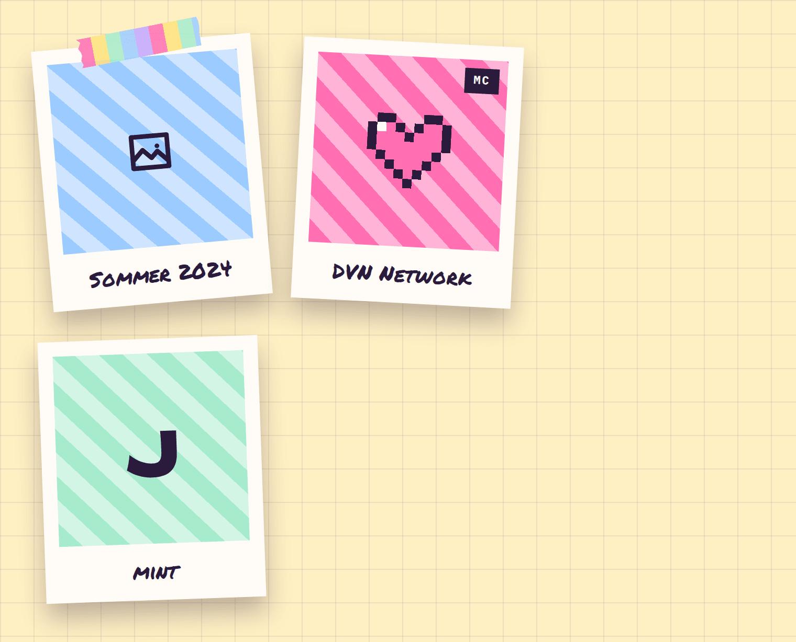

# Polaroid

**Foundations** · [all components](../../README.md#components)

Polaroid frame with handwritten caption, optional tape and corner tag - for photos or placeholders.



## Usage

```tsx
import { Icon, PixelHeart, Polaroid } from 'paperpop';

<div style={{ display: 'flex', flexWrap: 'wrap', gap: 34, alignItems: 'start' }}>
  <Polaroid width={210} tilt={-5} tape caption="Sommer 2024" color="sky"><Icon name="image" size={48} /></Polaroid>
  <Polaroid width={210} tilt={3} caption="DVN Network" tag="MC" color="pink"><PixelHeart size={80} style={{ color: 'var(--pp-pink)' }} /></Polaroid>
  <Polaroid width={210} tilt={-2} caption="mint" color="mint"><span className="pp-display" style={{ fontSize: 60 }}>J</span></Polaroid>
</div>
```

## Props

### Polaroid

| Prop | Type | Default | Description |
| --- | --- | --- | --- |
| `src` | `string` |  | Image URL. Without it the photo area shows a striped placeholder (or `children`). |
| `alt` | `string` |  | Alt text for the image. |
| `caption` | `ReactNode` |  | Handwritten caption under the photo. |
| `width` | `number \| string` |  | Frame width (number = px). Without it the frame uses the CSS variable --pw (default 300px). |
| `tilt` | `number` | `0` | Rotation in degrees. |
| `tape` | `boolean \| WashiProps` |  | Stick a piece of washi tape on top: `true` for a centered strip, or Washi props to place it yourself. |
| `color` | `PaperColor` | `'sky'` | Placeholder stripe colours. |
| `color2` | `string` |  | Override the second (lighter) stripe colour, any CSS colour. |
| `tag` | `string` |  | Small ink tag in the top right corner of the photo. |
| `ratio` | `string` | `'1'` | Photo aspect ratio. |
| `children` | `ReactNode` |  | Custom photo content (icon, big letter, anything). |

Also accepts: `HTMLAttributes<HTMLElement>` (native attributes are passed through).

\* required

## Source

- Component: [`src/components/foundations.tsx`](../../src/components/foundations.tsx)
- Example: [`stories/foundations.stories.tsx`](../../stories/foundations.stories.tsx)

<!-- Generated by scripts/docs.ts - edit the component or its story, not this file. -->
