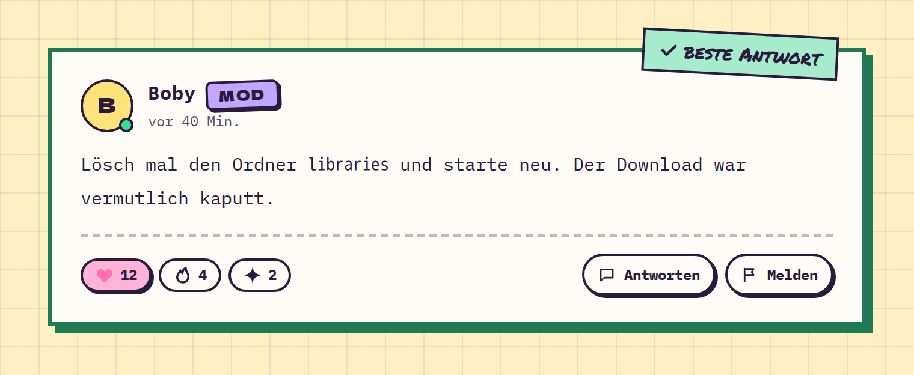

# Post

**Forum** · [all components](../../README.md#components)

Full forum post with author header, role badge, body, reactions and actions; can be marked as best answer.



## Usage

```tsx
import { Pill, Post } from 'paperpop';

<Post author="Boby" role="Mod" time="vor 40 Min." accepted
  reactions={[{ icon: 'heart', label: 'Herz', count: 12, active: true }, { icon: 'fire', label: 'Feuer', count: 4 }, { icon: 'sparkle', label: 'Glitzer', count: 2 }]}
  actions={<><Pill small icon="chat">Antworten</Pill><Pill small icon="flag">Melden</Pill></>}>
  <p>Lösch mal den Ordner <code>libraries</code> und starte neu. Der Download war vermutlich kaputt.</p>
</Post>
```

## Props

### Post

| Prop | Type | Default | Description |
| --- | --- | --- | --- |
| `author` * | `string` |  | Author name. |
| `avatar` | `string` |  | Author avatar URL. |
| `role` | `string` |  | Role badge ("Admin", "Mod", "OP"). |
| `time` * | `ReactNode` |  | Relative time. |
| `children` * | `ReactNode` |  | Post body. |
| `reactions` | `Reaction[]` |  | Reactions row. |
| `actions` | `ReactNode` |  | Buttons in the footer (Antworten, Melden …). |
| `accepted` | `boolean` |  | Highlight as accepted answer. |

Also accepts: `HTMLAttributes<HTMLElement>` (native attributes are passed through).

\* required

## Source

- Component: [`src/components/forum.tsx`](../../src/components/forum.tsx)
- Example: [`stories/forum.stories.tsx`](../../stories/forum.stories.tsx)

<!-- Generated by scripts/docs.ts - edit the component or its story, not this file. -->
