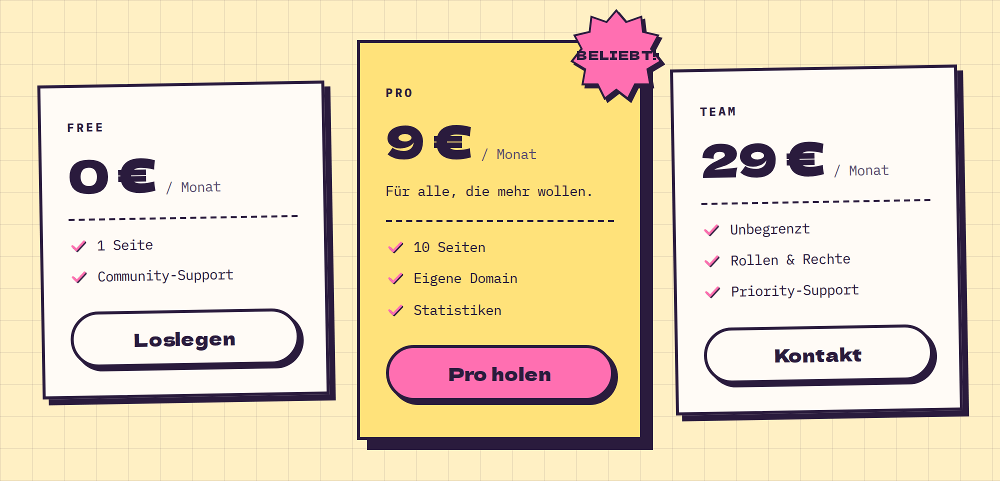

# PricingTable

**Landing** · [all components](../../README.md#components)

Pricing plans side by side; the featured one gets a sticker and a bigger shadow.



## Usage

```tsx
import { PricingTable } from 'paperpop';

<PricingTable plans={[
  { name: 'Free', price: '0 €', period: '/ Monat', features: ['1 Seite', 'Community-Support'], cta: 'Loslegen' },
  { name: 'Pro', price: '9 €', period: '/ Monat', description: 'Für alle, die mehr wollen.', features: ['10 Seiten', 'Eigene Domain', 'Statistiken'], cta: 'Pro holen', featured: true },
  { name: 'Team', price: '29 €', period: '/ Monat', features: ['Unbegrenzt', 'Rollen & Rechte', 'Priority-Support'], cta: 'Kontakt' },
]} />
```

## Props

### PricingTable

| Prop | Type | Default | Description |
| --- | --- | --- | --- |
| `plans` * | `Plan[]` |  |  |

Also accepts: `HTMLAttributes<HTMLDivElement>` (native attributes are passed through).

\* required

### PricingCard

| Prop | Type | Default | Description |
| --- | --- | --- | --- |
| `plan` * | `Plan` |  |  |
| `tilt` | `number` | `0` | Rotation in degrees. |

Also accepts: `Omit<HTMLAttributes<HTMLDivElement>, 'color'>` (native attributes are passed through).

\* required

## Source

- Component: [`src/components/landing.tsx`](../../src/components/landing.tsx)
- Example: [`stories/landing.stories.tsx`](../../stories/landing.stories.tsx)

<!-- Generated by scripts/docs.ts - edit the component or its story, not this file. -->
