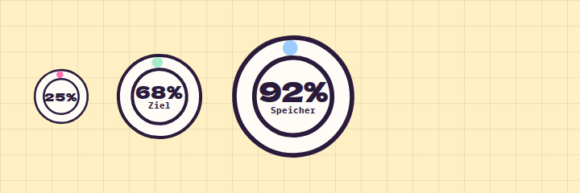

# ProgressRing

**Dashboard** · [all components](../../README.md#components) · animated

Circular progress for goals and quotas in three sizes.



## Usage

```tsx
import { ProgressRing } from 'paperpop';

<div style={{ display: 'flex', flexWrap: 'wrap', gap: 30, alignItems: 'center' }}>
  <ProgressRing value={25} size="sm" color="pink" />
  <ProgressRing value={68} label="Ziel" />
  <ProgressRing value={92} size="lg" color="sky" label="Speicher" />
</div>
```

## Props

### ProgressRing

| Prop | Type | Default | Description |
| --- | --- | --- | --- |
| `value` * | `number` |  | 0 - 100. |
| `size` | `Size` | `'md'` | Diameter. |
| `color` | `PaperColor` | `'mint'` | Ring colour. |
| `label` | `ReactNode` |  | Text under the percentage. |

Also accepts: `HTMLAttributes<HTMLDivElement>` (native attributes are passed through).

\* required

## Source

- Component: [`src/components/dashboard.tsx`](../../src/components/dashboard.tsx)
- Example: [`stories/dashboard.stories.tsx`](../../stories/dashboard.stories.tsx)

<!-- Generated by scripts/docs.ts - edit the component or its story, not this file. -->
