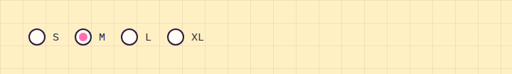

# RadioGroup

**Forms** · [all components](../../README.md#components) · animated

Round hand-drawn radio buttons, vertical or inline.



## Usage

```tsx
import { useState } from 'react';
import { RadioGroup } from 'paperpop';

function Example() {
  const [size, setSize] = useState('M');
  return <RadioGroup name="size" inline options={['S', 'M', 'L', 'XL']} value={size} onChange={setSize} />;
}
```

## Props

### RadioGroup

| Prop | Type | Default | Description |
| --- | --- | --- | --- |
| `name` * | `string` |  | Shared name of the radios. |
| `options` * | `Array<T \| { value: T; label: ReactNode }>` |  | Options as values or { value, label }. |
| `value` | `T` |  | Selected value. |
| `onChange` | `(value: T) => void` |  | Called with the new value. |
| `inline` | `boolean` |  | Lay out horizontally. |

Also accepts: `Omit<HTMLAttributes<HTMLDivElement>, 'onChange'>` (native attributes are passed through).

\* required

## Source

- Component: [`src/components/forms.tsx`](../../src/components/forms.tsx)
- Example: [`stories/forms.stories.tsx`](../../stories/forms.stories.tsx)

<!-- Generated by scripts/docs.ts - edit the component or its story, not this file. -->
