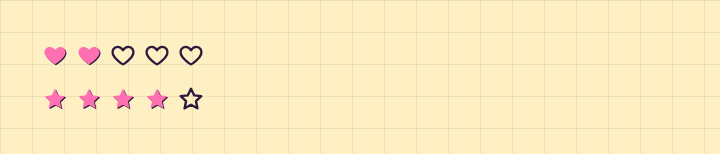

# Rating

**Forms** · [all components](../../README.md#components) · animated

Heart or star rating - interactive or read-only.



## Usage

```tsx
import { useState } from 'react';
import { Rating } from 'paperpop';

function Example() {
  const [v, setV] = useState(2);
  return (
    <div style={{ display: 'grid', gap: 14 }}>
      <Rating value={v} onChange={setV} />
      <Rating value={4} icon="star" />
    </div>
  );
}
```

## Props

### Rating

| Prop | Type | Default | Description |
| --- | --- | --- | --- |
| `value` * | `number` |  | Current rating. |
| `onChange` | `(value: number) => void` |  | Called with the new rating. Omit for a read-only display. |
| `max` | `number` | `5` | Number of hearts. |
| `icon` | `'heart' \| 'star'` | `'heart'` | Symbol. |
| `label` | `string` | `'Bewertung'` | Accessible label. |

Also accepts: `Omit<HTMLAttributes<HTMLDivElement>, 'onChange'>` (native attributes are passed through).

\* required

## Source

- Component: [`src/components/forms.tsx`](../../src/components/forms.tsx)
- Example: [`stories/forms.stories.tsx`](../../stories/forms.stories.tsx)

<!-- Generated by scripts/docs.ts - edit the component or its story, not this file. -->
