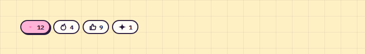

# Reactions

**Forum** · [all components](../../README.md#components) · animated

Toggleable reaction chips with counts.



## Usage

```tsx
import { Reactions } from 'paperpop';

<Reactions items={[
  { icon: 'heart', label: 'Herz', count: 12, active: true },
  { icon: 'fire', label: 'Feuer', count: 4 },
  { icon: 'thumbs-up', label: 'Daumen', count: 9 },
  { icon: 'sparkle', label: 'Glitzer', count: 1 },
]} />
```

## Props

### Reactions

| Prop | Type | Default | Description |
| --- | --- | --- | --- |
| `items` * | `Reaction[]` |  | Reactions with counts. |
| `onToggle` | `(label: string, active: boolean) => void` |  | Called with the toggled reaction label and new state. |

Also accepts: `Omit<HTMLAttributes<HTMLDivElement>, 'onChange' \| 'onToggle'>` (native attributes are passed through).

\* required

## Source

- Component: [`src/components/forum.tsx`](../../src/components/forum.tsx)
- Example: [`stories/forum.stories.tsx`](../../stories/forum.stories.tsx)

<!-- Generated by scripts/docs.ts - edit the component or its story, not this file. -->
