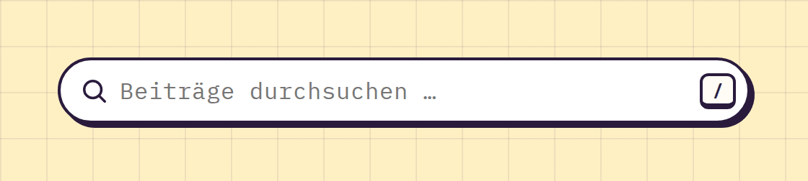

# SearchInput

**Forms** · [all components](../../README.md#components)

Rounded search field with icon, clear button and shortcut hint.



## Usage

```tsx
import { useState } from 'react';
import { SearchInput } from 'paperpop';

function Example() {
  const [q, setQ] = useState('');
  return <SearchInput value={q} onChange={setQ} shortcut="/" placeholder="Beiträge durchsuchen …" />;
}
```

## Props

### SearchInput

| Prop | Type | Default | Description |
| --- | --- | --- | --- |
| `value` * | `string` |  | Current query (controlled). |
| `onChange` * | `(value: string) => void` |  | Called with the new query. |
| `shortcut` | `string` |  | Shows a keyboard hint like "/" on the right. |

Also accepts: `Omit<InputHTMLAttributes<HTMLInputElement>, 'type' \| 'onChange'>` (native attributes are passed through).

\* required

## Source

- Component: [`src/components/forms.tsx`](../../src/components/forms.tsx)
- Example: [`stories/forms.stories.tsx`](../../stories/forms.stories.tsx)

<!-- Generated by scripts/docs.ts - edit the component or its story, not this file. -->
