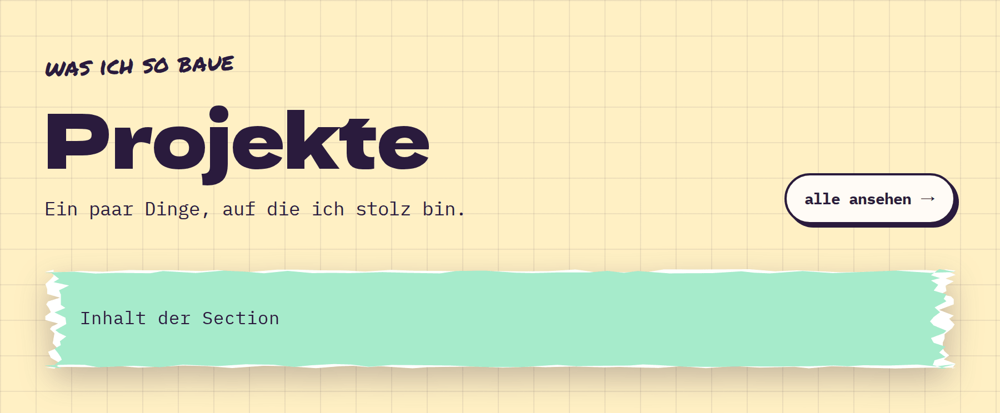

# Section

**Layout** · [all components](../../README.md#components)

Page section with kicker, big heading, intro and an aside slot - consistent spacing.



## Usage

```tsx
import { Paper, Pill, Section } from 'paperpop';

<Section space="sm" kicker="was ich so baue" title="Projekte" intro="Ein paar Dinge, auf die ich stolz bin." aside={<Pill href="#all">alle ansehen →</Pill>} style={{ padding: 0 }}>
  <Paper color="mint" edge="card-1">Inhalt der Section</Paper>
</Section>
```

## Props

### Section

| Prop | Type | Default | Description |
| --- | --- | --- | --- |
| `kicker` | `ReactNode` |  | Handwritten line above the title. |
| `title` | `ReactNode` |  | Section heading (big display font). |
| `intro` | `ReactNode` |  | Intro paragraph under the heading. |
| `aside` | `ReactNode` |  | Content on the right side of the heading row (links, buttons). |
| `space` | `'sm' \| 'md' \| 'lg'` | `'md'` | Vertical padding. |

Also accepts: `Omit<HTMLAttributes<HTMLElement>, 'title'>` (native attributes are passed through).

\* required

## Source

- Component: [`src/components/layout.tsx`](../../src/components/layout.tsx)
- Example: [`stories/layout.stories.tsx`](../../stories/layout.stories.tsx)

<!-- Generated by scripts/docs.ts - edit the component or its story, not this file. -->
