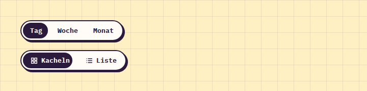

# SegmentedControl

**Buttons** · [all components](../../README.md#components) · animated

Connected toggle buttons for switching views (Tag / Woche / Monat).



## Usage

```tsx
import { useState } from 'react';
import { SegmentedControl } from 'paperpop';

function Example() {
  const [range, setRange] = useState('Tag');
  return (
    <div style={{ display: 'grid', gap: 18, justifyItems: 'start' }}>
      <SegmentedControl label="Zeitraum" options={['Tag', 'Woche', 'Monat']} value={range} onChange={setRange} />
      <SegmentedControl label="Ansicht" value="grid" onChange={() => {}} options={[{ value: 'grid', label: 'Kacheln', icon: 'grid' }, { value: 'list', label: 'Liste', icon: 'list' }]} />
    </div>
  );
}
```

## Props

### SegmentedControl

| Prop | Type | Default | Description |
| --- | --- | --- | --- |
| `options` * | `Array<T \| { value: T; label: ReactNode; icon?: IconName }>` |  | Options as values or { value, label, icon }. |
| `value` * | `T` |  | Selected value. |
| `onChange` * | `(value: T) => void` |  | Called with the new value. |
| `label` | `string` |  | Accessible group label. |

Also accepts: `Omit<HTMLAttributes<HTMLDivElement>, 'onChange'>` (native attributes are passed through).

\* required

## Source

- Component: [`src/components/buttons.tsx`](../../src/components/buttons.tsx)
- Example: [`stories/buttons.stories.tsx`](../../stories/buttons.stories.tsx)

<!-- Generated by scripts/docs.ts - edit the component or its story, not this file. -->
