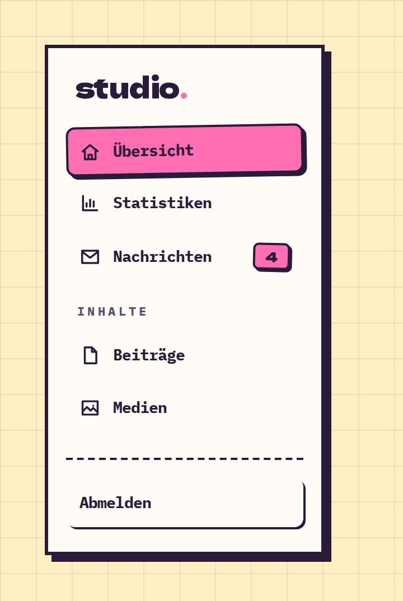

# Sidebar

**Navigation** · [all components](../../README.md#components)

Vertical app navigation with sections, icons, badges and a footer.



## Usage

```tsx
import { Sidebar } from 'paperpop';

<Sidebar
  brand="studio"
  sections={[
    { links: [{ label: 'Übersicht', href: '#', icon: 'home', active: true }, { label: 'Statistiken', href: '#s', icon: 'chart' }, { label: 'Nachrichten', href: '#m', icon: 'mail', badge: 4 }] },
    { title: 'Inhalte', links: [{ label: 'Beiträge', href: '#p', icon: 'file' }, { label: 'Medien', href: '#i', icon: 'image' }] },
  ]}
  footer={<a href="#logout" className="pp-pill pp-pill-sm">Abmelden</a>}
/>
```

## Props

### Sidebar

| Prop | Type | Default | Description |
| --- | --- | --- | --- |
| `brand` | `ReactNode` |  | Brand at the top. |
| `sections` * | `SidebarSection[]` |  | Link groups. |
| `footer` | `ReactNode` |  | Content pinned to the bottom (user, logout). |

Also accepts: `HTMLAttributes<HTMLElement>` (native attributes are passed through).

\* required

## Source

- Component: [`src/components/navigation.tsx`](../../src/components/navigation.tsx)
- Example: [`stories/navigation.stories.tsx`](../../stories/navigation.stories.tsx)

<!-- Generated by scripts/docs.ts - edit the component or its story, not this file. -->
