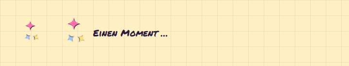

# Spinner

**Feedback** · [all components](../../README.md#components) · animated

Three twinkling sparkles circling - the loading indicator.



## Usage

```tsx
import { Spinner } from 'paperpop';

<div style={{ display: 'flex', flexWrap: 'wrap', gap: 40, alignItems: 'center' }}>
  <Spinner />
  <Spinner size={56} showLabel label="Einen Moment …" />
</div>
```

## Props

### Spinner

| Prop | Type | Default | Description |
| --- | --- | --- | --- |
| `size` | `number` | `44` | Size in px. |
| `label` | `string` | `'Lädt …'` | Visible text next to the spinner, also used as the accessible label. |
| `showLabel` | `boolean` |  | Show the label. |

Also accepts: `HTMLAttributes<HTMLSpanElement>` (native attributes are passed through).

\* required

## Source

- Component: [`src/components/feedback.tsx`](../../src/components/feedback.tsx)
- Example: [`stories/feedback.stories.tsx`](../../stories/feedback.stories.tsx)

<!-- Generated by scripts/docs.ts - edit the component or its story, not this file. -->
