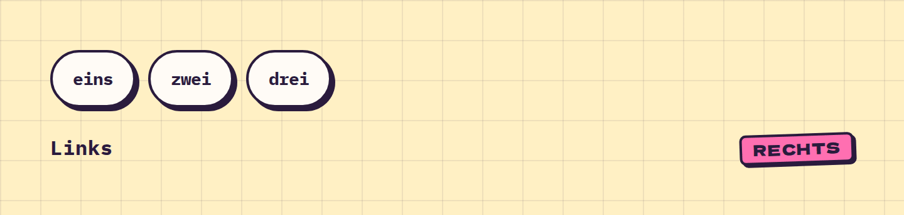

# Stack

**Layout** · [all components](../../README.md#components)

Flexbox helper for vertical or horizontal stacks with a gap.



## Usage

```tsx
import { Badge, Pill, Stack } from 'paperpop';

<Stack gap={20}>
  <Stack row gap={10}><Pill>eins</Pill><Pill>zwei</Pill><Pill>drei</Pill></Stack>
  <Stack row justify="between" align="center"><b>Links</b><Badge>rechts</Badge></Stack>
</Stack>
```

## Props

### Stack

| Prop | Type | Default | Description |
| --- | --- | --- | --- |
| `gap` | `number \| string` | `16` | Gap between children (number = px). |
| `row` | `boolean` |  | Row instead of column. |
| `align` | `'start' \| 'center' \| 'end' \| 'stretch' \| 'baseline'` |  | align-items. |
| `justify` | `'start' \| 'center' \| 'end' \| 'between'` |  | justify-content. |
| `wrap` | `boolean` | `true for rows` | Wrap rows. |
| `as` | `ElementType` | `'div'` | Rendered element. |

Also accepts: `HTMLAttributes<HTMLElement>` (native attributes are passed through).

\* required

## Source

- Component: [`src/components/layout.tsx`](../../src/components/layout.tsx)
- Example: [`stories/layout.stories.tsx`](../../stories/layout.stories.tsx)

<!-- Generated by scripts/docs.ts - edit the component or its story, not this file. -->
