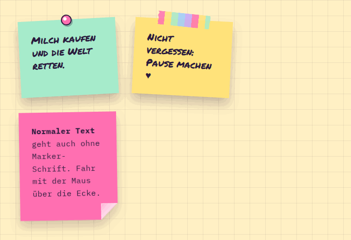

# StickyNote

**Foundations** · [all components](../../README.md#components) · animated

Sticky note with a peeling corner (lifts further on hover), pinned with a pushpin or tape.



## Usage

```tsx
import { Marker, StickyNote } from 'paperpop';

<div style={{ display: 'flex', flexWrap: 'wrap', gap: 34 }}>
  <StickyNote color="mint" pin hand style={{ width: 200 }}>Milch kaufen und die Welt retten.</StickyNote>
  <StickyNote color="butter" tape tilt={3} hand style={{ width: 200 }}>Nicht vergessen: Pause machen ♥</StickyNote>
  <StickyNote color="pink" tilt={-1} curl style={{ width: 200 }}><b>Normaler Text</b><p>geht auch ohne Marker-Schrift. Fahr mit der Maus über die Ecke.</p></StickyNote>
</div>
```

## Props

### StickyNote

| Prop | Type | Default | Description |
| --- | --- | --- | --- |
| `color` | `PaperColor` | `'mint'` | Note colour. |
| `tilt` | `number` | `-3` | Rotation in degrees. |
| `pin` | `boolean` |  | Stick it on with a pushpin instead of tape. |
| `tape` | `boolean` |  | Stick it on with washi tape. |
| `hand` | `boolean` |  | Handwritten body text. |
| `curl` | `boolean` |  | Curled bottom-right corner. |

Also accepts: `HTMLAttributes<HTMLDivElement>` (native attributes are passed through).

\* required

## Source

- Component: [`src/components/foundations.tsx`](../../src/components/foundations.tsx)
- Example: [`stories/foundations.stories.tsx`](../../stories/foundations.stories.tsx)

<!-- Generated by scripts/docs.ts - edit the component or its story, not this file. -->
