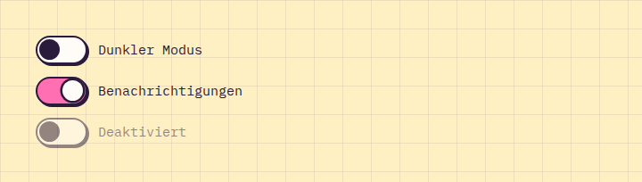

# Switch

**Forms** · [all components](../../README.md#components) · animated

On/off toggle with a bouncy knob.



## Usage

```tsx
import { Switch } from 'paperpop';

<div style={{ display: 'grid', gap: 14 }}>
  <Switch label="Dunkler Modus" />
  <Switch label="Benachrichtigungen" defaultChecked color="pink" />
  <Switch label="Deaktiviert" disabled />
</div>
```

## Props

### Switch

| Prop | Type | Default | Description |
| --- | --- | --- | --- |
| `label` | `ReactNode` |  | Label next to the switch. |
| `color` | `PaperColor` | `'mint'` | Track colour when on. |

Also accepts: `Omit<InputHTMLAttributes<HTMLInputElement>, 'type' \| 'size'>` (native attributes are passed through).

\* required

## Source

- Component: [`src/components/forms.tsx`](../../src/components/forms.tsx)
- Example: [`stories/forms.stories.tsx`](../../stories/forms.stories.tsx)

<!-- Generated by scripts/docs.ts - edit the component or its story, not this file. -->
