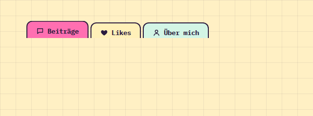

# Tabs

**Navigation** · [all components](../../README.md#components) · animated

Folder-style index tabs sticking out of a card; arrow keys switch.



## Usage

```tsx
import { Tabs } from 'paperpop';

<Tabs items={[
  { id: 'posts', label: 'Beiträge', icon: 'chat', content: <p>Hier stehen die neuesten Beiträge.</p> },
  { id: 'likes', label: 'Likes', icon: 'heart', content: <p>Alles, was dir gefallen hat.</p> },
  { id: 'about', label: 'Über mich', icon: 'user', content: <p>Entwickler, Ex-DVN, frisch ausgelernt.</p> },
]} />
```

## Props

### Tabs

| Prop | Type | Default | Description |
| --- | --- | --- | --- |
| `items` * | `TabItem[]` |  | Tabs with content. |
| `value` | `string` |  | Active tab id (controlled). Leave undefined for uncontrolled. |
| `onChange` | `(id: string) => void` |  | Called with the new tab id. |
| `colorful` | `boolean` | `true` | Folder tab colours cycle through the palette. |

Also accepts: `Omit<HTMLAttributes<HTMLDivElement>, 'onChange'>` (native attributes are passed through).

\* required

## Source

- Component: [`src/components/navigation.tsx`](../../src/components/navigation.tsx)
- Example: [`stories/navigation.stories.tsx`](../../stories/navigation.stories.tsx)

<!-- Generated by scripts/docs.ts - edit the component or its story, not this file. -->
