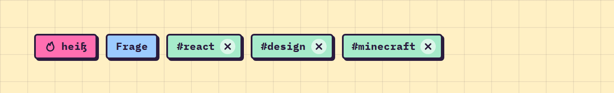

# Tag

**Feedback** · [all components](../../README.md#components)

Chips for tags, filters and categories - optionally with icon and remove button.



## Usage

```tsx
import { useState } from 'react';
import { Tag } from 'paperpop';

function Example() {
  const [tags, setTags] = useState(['react', 'design', 'minecraft']);
  return (
    <div style={{ display: 'flex', gap: 10, flexWrap: 'wrap' }}>
      <Tag icon="fire" color="pink">heiß</Tag>
      <Tag color="sky">Frage</Tag>
      {tags.map((t) => <Tag key={t} color="mint" onRemove={() => setTags(tags.filter((x) => x !== t))}>#{t}</Tag>)}
    </div>
  );
}
```

## Props

### Tag

| Prop | Type | Default | Description |
| --- | --- | --- | --- |
| `color` | `Tone` | `'butter'` | Colour. |
| `icon` | `IconName` |  | Icon before the label. |
| `onRemove` | `() => void` |  | Shows an x button. |

Also accepts: `HTMLAttributes<HTMLSpanElement>` (native attributes are passed through).

\* required

## Source

- Component: [`src/components/feedback.tsx`](../../src/components/feedback.tsx)
- Example: [`stories/feedback.stories.tsx`](../../stories/feedback.stories.tsx)

<!-- Generated by scripts/docs.ts - edit the component or its story, not this file. -->
