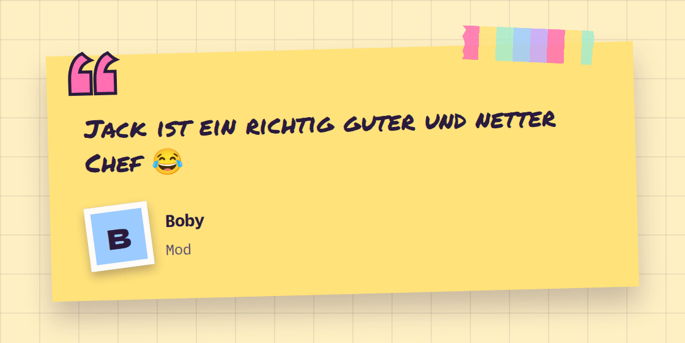

# Testimonial

**Landing** · [all components](../../README.md#components)

Quote on a taped note with a mini polaroid of the author.



## Usage

```tsx
import { Testimonial } from 'paperpop';

<Testimonial quote="Jack ist ein richtig guter und netter Chef 😂" name="Boby" role="Mod" />
```

## Props

### Testimonial

| Prop | Type | Default | Description |
| --- | --- | --- | --- |
| `quote` * | `ReactNode` |  | The quote. |
| `name` * | `ReactNode` |  | Who said it. |
| `role` | `ReactNode` |  | Role / company / handle. |
| `src` | `string` |  | Photo URL - shown as a mini polaroid. |
| `color` | `PaperColor` | `'butter'` | Note colour. |
| `tilt` | `number` | `-1.5` | Rotation in degrees. |

Also accepts: `Omit<HTMLAttributes<HTMLElement>, 'role' \| 'color'>` (native attributes are passed through).

\* required

## Source

- Component: [`src/components/landing.tsx`](../../src/components/landing.tsx)
- Example: [`stories/landing.stories.tsx`](../../stories/landing.stories.tsx)

<!-- Generated by scripts/docs.ts - edit the component or its story, not this file. -->
