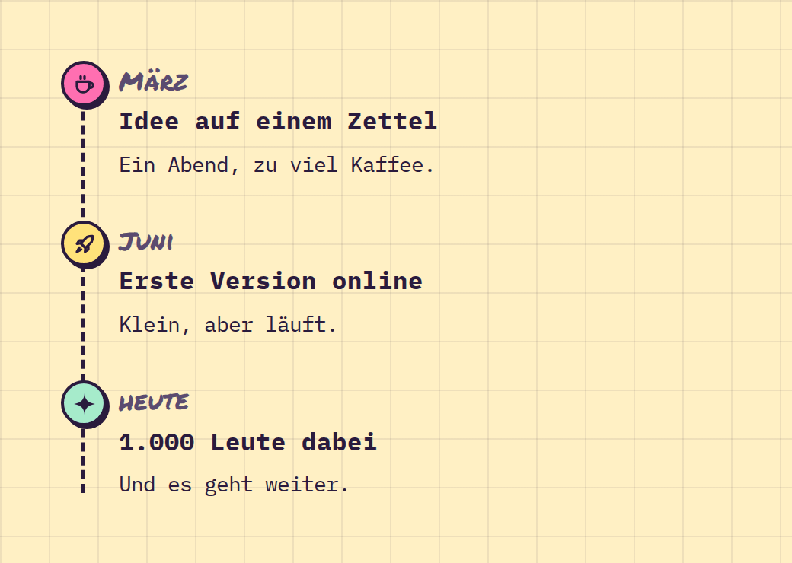

# Timeline

**Navigation** · [all components](../../README.md#components)

Vertical timeline with a dashed line and pastel dots.



## Usage

```tsx
import { Timeline } from 'paperpop';

<Timeline items={[
  { date: 'März', title: 'Idee auf einem Zettel', text: 'Ein Abend, zu viel Kaffee.', icon: 'coffee' },
  { date: 'Juni', title: 'Erste Version online', text: 'Klein, aber läuft.', icon: 'rocket' },
  { date: 'heute', title: '1.000 Leute dabei', text: 'Und es geht weiter.', icon: 'sparkle' },
]} />
```

## Props

### Timeline

| Prop | Type | Default | Description |
| --- | --- | --- | --- |
| `items` * | `Array<{ date: ReactNode; title: ReactNode; text?: ReactNode; color?: PaperColor; icon?: IconName }>` |  | Entries, newest first or oldest first - your call. |

Also accepts: `HTMLAttributes<HTMLOListElement>` (native attributes are passed through).

\* required

## Source

- Component: [`src/components/navigation.tsx`](../../src/components/navigation.tsx)
- Example: [`stories/navigation.stories.tsx`](../../stories/navigation.stories.tsx)

<!-- Generated by scripts/docs.ts - edit the component or its story, not this file. -->
