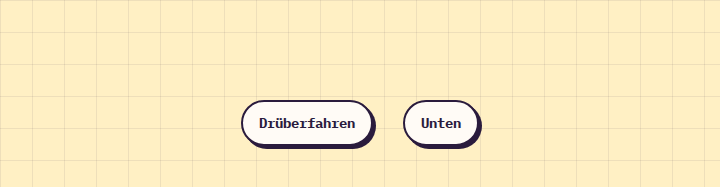

# Tooltip

**Feedback** · [all components](../../README.md#components) · animated

Tiny sticky-note tooltip on hover and keyboard focus.



## Usage

```tsx
import { Pill, Tooltip } from 'paperpop';

<div style={{ display: 'flex', flexWrap: 'wrap', gap: 30, justifyContent: 'center', paddingTop: 60 }}>
  <Tooltip content="Das ist ein Tooltip ♥"><Pill>Drüberfahren</Pill></Tooltip>
  <Tooltip content="Unten geht auch" side="bottom" color="mint"><Pill>Unten</Pill></Tooltip>
</div>
```

## Props

### Tooltip

| Prop | Type | Default | Description |
| --- | --- | --- | --- |
| `content` * | `ReactNode` |  | Tooltip text. |
| `side` | `'top' \| 'bottom'` | `'top'` | Side. |
| `color` | `PaperColor` | `'butter'` | Note colour. |

Also accepts: `Omit<HTMLAttributes<HTMLSpanElement>, 'content'>` (native attributes are passed through).

\* required

## Source

- Component: [`src/components/feedback.tsx`](../../src/components/feedback.tsx)
- Example: [`stories/feedback.stories.tsx`](../../stories/feedback.stories.tsx)

<!-- Generated by scripts/docs.ts - edit the component or its story, not this file. -->
