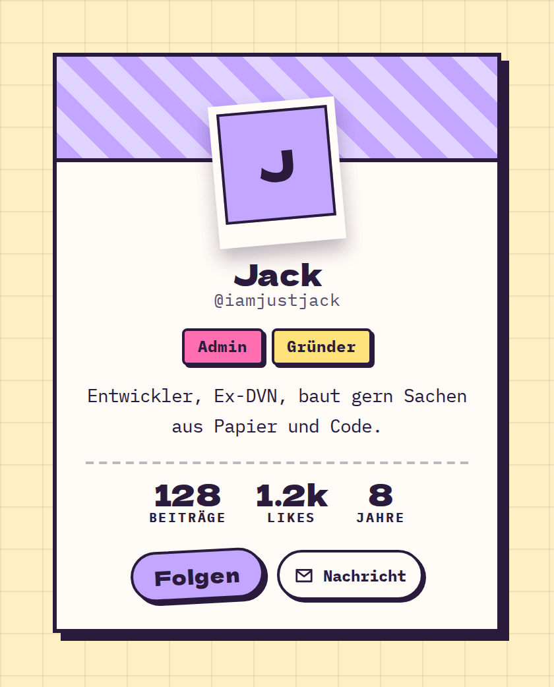

# UserCard

**Forum** · [all components](../../README.md#components)

Profile card with polaroid avatar, badges, bio, stats and actions.



## Usage

```tsx
import { Pill, UserCard } from 'paperpop';

<UserCard name="Jack" handle="@iamjustjack" bio="Entwickler, Ex-DVN, baut gern Sachen aus Papier und Code."
  badges={[{ label: 'Admin', color: 'pink' }, { label: 'Gründer', color: 'butter' }]}
  stats={[{ label: 'Beiträge', value: 128 }, { label: 'Likes', value: '1.2k' }, { label: 'Jahre', value: 8 }]}
  actions={<><button type="button" className="pp-btn pp-btn-sm">Folgen</button><Pill small icon="mail">Nachricht</Pill></>} />
```

## Props

### UserCard

| Prop | Type | Default | Description |
| --- | --- | --- | --- |
| `name` * | `string` |  | Display name. |
| `handle` | `string` |  | @handle or subtitle. |
| `src` | `string` |  | Avatar URL. |
| `bio` | `ReactNode` |  | Short bio. |
| `badges` | `Array<{ label: string; color?: Tone }>` |  | Role badges. |
| `stats` | `Array<{ label: string; value: ReactNode }>` |  | Stats row, e.g. [{ label: 'Beiträge', value: 128 }]. |
| `actions` | `ReactNode` |  | Buttons (Folgen, Nachricht). |
| `color` | `PaperColor` | `'lilac'` | Header colour. |

Also accepts: `HTMLAttributes<HTMLDivElement>` (native attributes are passed through).

\* required

## Source

- Component: [`src/components/forum.tsx`](../../src/components/forum.tsx)
- Example: [`stories/forum.stories.tsx`](../../stories/forum.stories.tsx)

<!-- Generated by scripts/docs.ts - edit the component or its story, not this file. -->
